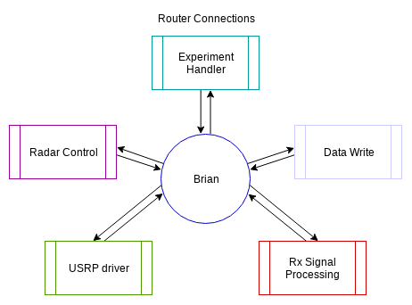

=====
Brian
=====

Brian is an administrator process for Borealis. It acts as a router for all messages in the system
and it is responsible for controlling the flow of logic. This process was originally called Brain,
but after repeated misspellings, the name Brian stuck.

Brian implements a ZMQ router in order for all the other processes to connect. Using a ZMQ router
lets us use a feature of ZMQ called "named sockets". The premise of named sockets is that we can
connect to a single router address, and when we connect we can supply a name for the socket we are
connecting from. ZMQ's router process will then automatically know how to send data to that socket
if another socket sends to the identity instead of an address. This makes following the flow of
messages much easier to track. By having all messages flow through a router, it's possible to log
the flow of data between sockets to make sure that the pipeline of messages is occurring in the
correct order, and if not it is a helpful tool in debugging.

   Block diagram of ZMQ connections

Brian is also responsible for rate controlling the system. Since all the traffic routes through this
module, it is an ideal place to make sure that the pipeline isn't being overwhelmed by any modules.
This step is very important to make sure that the GPU processing isn't being overloaded with work or
that too many new requests enter the USRP driver.

.. automodule:: src.brian
    :members:
    :undoc-members:
    :show-inheritance:
