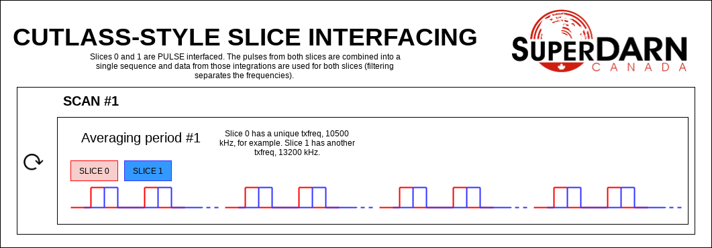
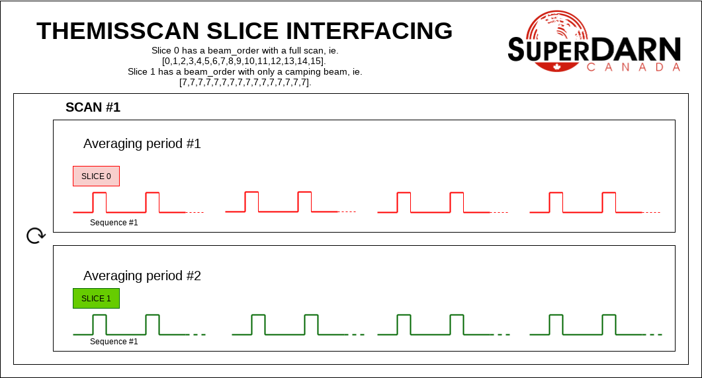
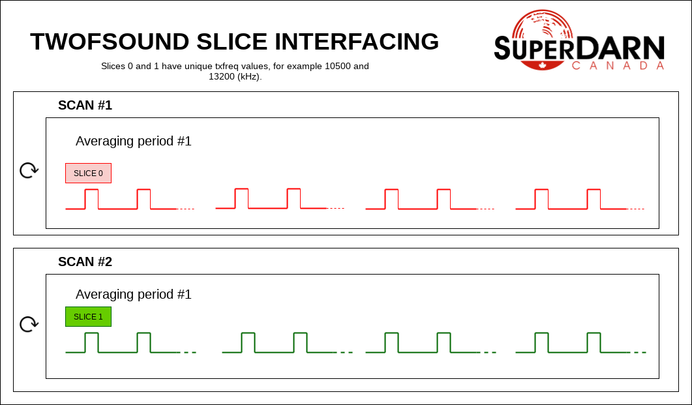
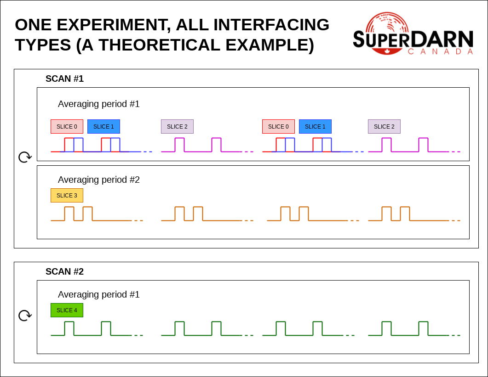

.. _building-experiments:

======================
Building an Experiment
======================

Borealis has an extensive set of features and this means that experiments can be designed to be very
simple or very complex. To help organize writing of experiments, we've designed the system so that
experiments can be broken into smaller components, called **slices**, that interface together with
other components to perform desired functionality. An experiment can have a single slice or several
working together, depending on the complexity.

Each slice contains the information needed about a specific pulse sequence to run. The parameters of
a slice contain features such as pulse sequence, frequency, fundamental time lag spacing, etc. These
are the parameters that researchers will be familiar with. Each slice can be an experiment on its
own, or can be just a piece of a larger experiment.

..  toctree::
    :glob:

    new_experiments

-------------------------------
Introduction to Borealis Slices
-------------------------------

Slices are software objects made for the Borealis system that allow easy integration of multiple
modes into a single experiment. Each slice could be an experiment on its own, and averaged data
products are produced from each slice individually. Slices can be used to create separate frequency
channels, separate pulse sequences, separate beam scanning order, etc. that can run simultaneously.

A slice is defined using a python dictionary with the necessary slice keys. For a complete list of
keys that can be used in a slice, see `Slice Keys`_.

The other necessary part of an experiment is specifying how slices will interface with each other.
Interfacing in this case refers to how these two components are meant to be run. To understand the
interfacing, lets first understand the basic building blocks of a SuperDARN experiment. These are:

**Sequence**

Made up of pulses of a specific duration (pulse length) with a specified fundamental (tau) spacing,
at a specified frequency, and with a specified receive time (duration) following the transmission
(to gather information from the number of ranges specified). Researchers might be familiar with a
common SuperDARN 7 or 8 pulse sequence design. The sequence definition here is the time to transmit
one sequence and the time for receiving echoes from that sequence.

**Averaging period**

A time duration where the sequences are repeated to gather enough information to average and reduce
the effect of spurious emissions on the data. These are defined by either a number of sequences, or a
length of time during which as many sequences as possible are transmitted. For example, researchers
may be familiar with the standard 3 second averaging period in which ~30 pulse sequences are sent
out and received in a single beam direction.

**Scan**

A time where the averaging periods are repeated, traditionally to look in different beam directions
with each averaging period. A scan is defined by the number of beams or integration times.
Researchers may be familiar with the standard 1-minute 16-beam scan from East to West, or West to
East, depending upon the radar.

--------------------------------
Interfacing Types Between Slices
--------------------------------

.. autodata:: src.experiment_prototype.experiment_prototype.interface_types
    :noindex:

--------------------------
Slice Interfacing Examples
--------------------------

Let's look at some examples of common experiments that can easily be separated into multiple slices.
In these examples, the ⟳ means that the averaging period is repeated multiple times in a scan, and
the different slices are colour coded.

In a CUTLASS-style experiment, the pulse in the sequence is actually two pulses of differing
transmit frequency. This is a 'quasi'-simultaneous multi-frequency experiment where the frequency
changes in the middle of the pulse. To build this experiment, two slices can be CONCURRENT
interfaced. The pulses from both slices are combined into a single set of transmitted samples for
that sequence and samples received from those sequences are used for both slices (filtering the raw
data separates the frequencies).

In a themisscan experiment, a single beam is interleaved with a full scan. The beam_order can be
unique to different slices, and these slices could be AVEPERIOD interfaced to separate the camping
beam data from the full scan, if desired. With AVEPERIOD interfacing, one averaging period of one
slice will be followed by an averaging period of another, and so on. The averaging periods are
interleaved. The resulting experiment runs beams 0, 7, 1, 7, etc.

In a twofsound experiment, a full scan of one frequency is followed by a full scan of another
frequency. The txfreq are unique between the slices. In this experiment, the slices are SCAN
interfaced. A full scan of slice 0 runs followed by a full scan of slice 1, and then the process
repeats.

Here's a theoretical example showing all types of interfacing. In this example, slices 0 and 1 are
CONCURRENT interfaced. Slices 0 and 2 are SEQUENCE interfaced (Note that when slices 0 and 2 are
SEQUENCE interfaced, that automatically implies that slices 1 and 2 are also SEQUENCE interfaced).
Slices 0 and 3 are AVEPERIOD interfaced (again, note that this implies that slices 1 and 3 are
AVEPERIOD interfaced, additionally that slices 2 and 3 are AVEPERIOD interfaced). Slices 0 and 4 are
SCAN interfaced (finally, to really drive home this point, this implies that slices 1 and 4 are SCAN
interfaced, slices 2 and 4 are SCAN interfaced, and slices 3 and 4 are SCAN interfaced).

---------------------
Writing an Experiment
---------------------

All experiments must be written as their own class and must be built off of the built-in
ExperimentPrototype class.

This means the ExperimentPrototype class must be imported at the start of the experiment file ::

    from experiment_prototype.experiment_prototype import ExperimentPrototype

Please name the class within the experiment file in a similar fashion to the file, as the class name
is written to the datasets produced.

The experiment has the following experiment-wide attributes:

cpid *required*
    The only experiment-wide attribute that is required to be set by the user when initializing is
    the CPID, or control program identifier. This must be unique to the experiment. You will need to
    request this from your institution's radar operator. You should clearly document the name of the
    experiment and some operating details that correspond to the CPID. Please see `this SuperDARN
    Canada webpage <https://superdarn.ca/cpid-info>`_ for more information, and to see lists of CPIDs
    that already exist.

output_rx_rate *defaults*
    The sampling rate of the output data. The default is 10.0e3/3 Hz, or 3.333 kHz.

rx_bandwidth *defaults*
    The sampling rate of the USRPs (before decimation). The default is 5.0e6 Hz, or 5 MHz.

tx_bandwidth *defaults*
    The output sampling rate of the transmitted signal. The default is 5.0e6 Hz, or 5 MHz.

comment_string *defaults*
    A comment string describing the experiment. It is highly encouraged to provide some description
    of the experiment for the output data files. The default is '', or an empty string.

Below is an example of properly inheriting the prototype class and defining your own experiment::

    class MyClass(ExperimentPrototype):

        def __init__(self):
            cpid = 123123  # this must be a unique id for your control program.
            super().__init__(cpid,
                comment_string='My experiment explanation')

The experiment handler will create an instance of your experiment when your experiment is scheduled
to start running. Your class is a child class of ExperimentPrototype and because of this, the parent
class needs to be instantiated when the experiment is instantiated. This is important because the
experiment_handler will build the scans required by your class in a way that is easily readable and
iterable by the radar control program. This is done by methods that are set up in the
ExperimentPrototype parent class.

The next step is to add slices to your experiment. An experiment is defined by the slices in the
class, and how the slices interface. As mentioned above, slices are just python dictionaries, with a
preset list of keys available to define your experiment. The keys that can be used in the slice
dictionary are described below.

----------
Slice Keys
----------

.. autoclass:: src.experiment_prototype.experiment_slice.ExperimentSlice()
    :noindex:

------------------
Experiment Example
------------------

An example of adding a slice to your experiment is as follows::

        tau_spacing = 2100
        first_slice = {  # slice_id will be 0, there is only one slice.
            "pulse_sequence": [0, 9, 12, 20, 22, 26, 27],  # the common 7-pulse sequence in SDARN
            "tau_spacing": tau_spacing,  # us
            "pulse_len": 300,  # us
            "num_ranges": 75,  # range gates
            "first_range": 180,  # first range gate, in km
            "intt": 3500,  # duration of an integration, in ms
            "beam_angle": [-24.3, -21.06, -17.82, -14.58, -11.34, -8.1, -4.86, -1.62, 1.62, 4.86, 8.1, 11.34,
            14.58, 21.06, 24.3],  # 16 beams, separated by 3.24 degrees
            "rx_beam_order": [15, 14, 13, 12, 11, 10, 9, 8, 7, 6, 5, 4, 3, 2, 1, 0],
            "tx_beam_order": [15, 14, 13, 12, 11, 10, 9, 8, 7, 6, 5, 4, 3, 2, 1, 0],
            "scanbound": [i * 3.5 for i in range(len(beams_to_use))], #1 min scan
            "freq" : 10500, #kHz
            "acf": True,
            "xcf": True,  # cross-correlation processing
            "acfint": True,  # interferometer acfs
            "wait_for_first_scanbound": False,
        }

        self.add_slice(first_slice)

This slice would be assigned with ``slice_id = 0`` if it's the first slice added to the experiment. The
experiment could also add another slice::

        second_slice = copy.deepcopy(first_slice)
        second_slice['freq'] = 13200 # kHz
        second_slice['comment'] = 'This is my second slice, it has a different frequency.'

        self.add_slice(second_slice, interfacing_dict={0: 'SCAN'})

Notice that you must specify interfacing to an existing slice when you add a second or greater order
slice to the experiment. To see the types of interfacing that can be used, see the above section
`Interfacing Types Between Slices`_.

This experiment is very similar to the twofsound experiment. To see examples of common experiments,
look at :doc:`experiments`.

-----------------------------------
Checking Your Experiment for Errors
-----------------------------------

An experiment testing script ``experiment_unittests.py`` has been written to check experiments for
errors and ensure the operation of experiment checking source code. This suite of tests can be run
by the following command::

        python3 BOREALISPATH/tests/experiments/experiment_unittests.py

This will test all experiments within the ``borealis_experiments`` directory, and run all
exception-checking unit tests within the testing_archive directory of the experiments directory.
At the end, the results of all tests will be summarized, showing how many tests passed and failed.

This testing script can also be used to check specific experiments are written correctly. To do
this, ensure your experiment is in the ``src/borealis_experiments`` directory and run the following
command::

        python3 BOREALISPATH/tests/experiments/experiment_unittests.py --experiment [EXPERIMENT_NAME]

where EXPERIMENT_NAME is the module name of your experiment. If there are any errors while checking
your experiment, the test will fail and the exception will describe the error.

..  toctree::
    :glob:

    experiment_unittests.rst
