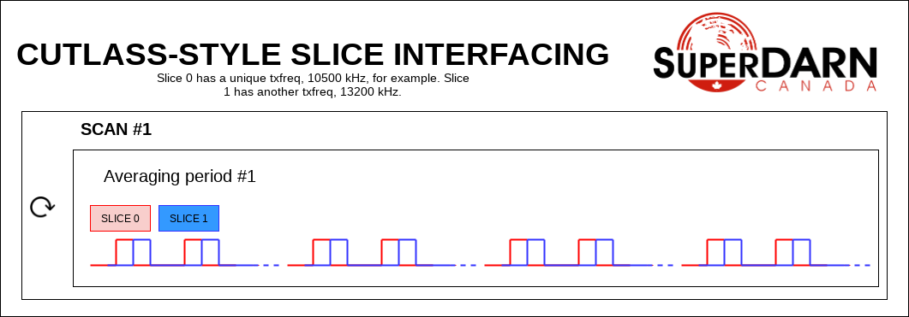

**********************
Building an Experiment
**********************

Borealis has an extensive set of features and this means that experiments can end up having lots of functionality and complicated functions. To help organize writing of experiments, we've designed the system so that experiments can be broken into smaller components, called slices, that interface together with other components to perform desired functionality. An experiment can have a single slice or several working together, depending on the complexity.

Each slice contains the information needed about a specific pulse sequence to run. The parameters of a slice contain features such as pulse sequence, frequency, fundamental time lag spacing, etc. These are the parameters that researchers will be familiar with. Each slice can be an experiment on its
own, or can be just a piece of a larger experiment. 

What are slices? 
----------------

Slices are software objects made for the Borealis system that allow easy integration of 
multiple modes into a single experiment. Each slice could be an experiment on its own, and 
averaged products are produced from each slice individually. Slices can be used to create 
separate frequency channels, separate pulse sequences, separate beam scanning order, 
etc. that can run simultaneously. Slices can be interfaced in four different ways. 
 
The following parameters are unique to a slice:  

* tx or rx frequency
* pulse sequence
* tau spacing (mpinc)
* pulse length
* number of range gates
* first range gate
* beam directions
* beam order

The other necessary part of an experiment is specifying how slices will interface with each other. Interfacing in this case refers to how these two components are meant to be run. To understand the interfacing, lets first understand the basic building blocks of a SuperDARN experiment. These are:

**Sequence (integration)**  

Made up of pulses with a specific spacing, at a specific frequency, and with a specified receive time 
following the transmission (to gather information from the number of ranges specified).

**Averaging period (integration time)**  

A time where the sequences are repeated to gather enough information to average and reduce the effect of 
spurious emissions on the data. These are defined by either number of sequences, or a length of time during 
which as many sequences as possible are transmitted.

**Scan**  

A time where the averaging periods are repeated, often with the pulses mixed to look in different beam 
directions with each averaging period. A scan is defined by the number of beams or integration times.

Interfacing types
-----------------

Knowing the basic building blocks of a SuperDARN-style experiment, the following types of interfacing are possible:

**1. SCAN**   

The scan by scan interfacing allows for slices to run a scan of one slice, followed by a scan of the second. The scan mode of interfacing typically means that the slice will cycle through all of its beams before switching to another slice.

**2. INTTIME**   

This type of interfacing allows for an integration period to run for one slice, before switching to another. This type of interface effectively creates an interleaving scan where the scans for different slices are run simultaneously, however the pulse sequences are alternated integration time by 
integration time rather than run concurrently.

**3. INTEGRATION**   

Integration interfacing allows for pulse sequences defined in the slices to alternate sequence by sequence each other within an integration period. Slices which are interfaced in this manner must share the same INTT and INTN values for this to work. It's important to remember that each sequence 
only averages with sequences from the same slice. 

**4. PULSE**   

Pulse interfacing allows for pulse sequences to be run together concurrently. Slices will have their pulse sequences mixed and layered together so that the data transmits at the same time. Slices of different frequencies can be 
mixed simultaneously and slices of different pulse sequences can also run together at the cost of having more blanked samples.

Let's look at some examples of common experiments that can easily be separated into multiple slices. 

In a CUTLASS-style experiment, the pulse in the sequence is actually two pulses of differing transmit frequency. This is a 'quasi'-simultaneous multi-frequency experiment. To build this experiment, two slices can be PULSE interfaced. The pulses from both slices are combined into a single sequence and data from those integrations are used for both slices (filtering the raw data separates the frequencies). 

In a themisscan experiment, a single beam is interleaved with a full scan. The beam_order can be unique to different slices, and these slices could be INTTIME interfaced to separate the camping beam data from the full scan,
if desired. With INTTIME interfacing, one averaging period of one slice will be followed by an averaging period of another, and so on. The averaging periods are interleaved. The resulting experiment runs beams 0, 7, 1, 7, etc. 

.. image:: img/themisscan.png
   :width: 800px
   :alt: THEMISSCAN slice interfacing 
   :align: center

In a twofsound experiment, a full scan of one frequency is followed by a full scan of another frequency. The txfreq are unique between the slices. In this experiment, the slices are SCAN interfaced. A full scan of slice 0 runs 
followed by a full scan of slice 1, and then the process repeats. 

.. image:: img/twofsound.png
   :width: 800px
   :alt: TWOFSOUND slice interfacing 
   :align: center

Here's a theoretical example showing all types of interfacing. In this example, slices 0 and 1 are PULSE interfaced. Slices 0 and 2 are INTEGRATION interfaced. Slices 0 and 3 are INTTIME interfaced. Slices 0 and 4 are SCAN interfaced.

.. image:: img/one-experiment-all-interfacing-types.png
   :width: 800px
   :alt: An example showing all types of slice interfacing 
   :align: center

Slice Keys
----------
A slice is defined by the user as a dictionary, with the following preset keys:

slice_id
    The ID of this slice object. An experiment can have multiple slices.

cpid
    The ID of the experiment, consistent with existing radar control programs.

tx_antennas
    The antennas to transmit on, default is all main antennas given max
    number from config.

rx_main_antennas
    The antennas to receive on in main array, default = all antennas
    given max number from config.

rx_int_antennas
    The antennas to receive on in interferometer array, default is all
    antennas given max number from config.

pulse_sequence
    The pulse sequence timing, given in quantities of tau_spacing, for example
    normalscan = [0, 14, 22, 24, 27, 31, 42, 43]

tau_spacing
    multi-pulse increment in us, Defines minimum space between pulses.

pulse_phase_offset
    Allows phase shifting between pulses, enabling encoding of pulses. Default all
    zeros for all pulses in pulse_sequence.

pulse_len
    length of pulse in us. Range gate size is also determined by this.

num_ranges
    Number of range gates.

first_range
    first range gate, in km

intt
    duration of an integration, in ms. (maximum)

intn
    number of averages to make a single integration, if intt = None.

beam_angle
    list of beam directions, in degrees off azimuth. Positive is E of N. Array
    length = number of beams. Traditionally beams have been 3.24 degrees separated but we
    don't refer to them as beam -19.64 degrees, we refer as beam 1, beam 2. Beam 0 will
    be the 0th element in the list, beam 1 will be the 1st, etc. These beam numbers are
    needed to write the beam_order list. This is like a mapping of beam number (list
    index) to beam direction off boresight.

beam_order
    beam numbers written in order of preference, one element in this list corresponds to
    one integration period. Can have lists within the list, resulting in multiple beams
    running simultaneously in the averaging period, so imaging. A beam number of 0 in
    this list gives us the direction of the 0th element in the beam_angle list. It is
    up to the writer to ensure their beam pattern makes sense. Typically beam_order is
    just in order (scanning W to E or E to W, ie. [0, 1, 2, 3, 4, 5, 6, 7, 8, 9, 10,
    11, 12, 13, 14, 15]. You can list numbers multiple times in the beam_order list,
    for example [0, 1, 1, 2, 1] or use multiple beam numbers in a single
    integration time (example [[0, 1], [3, 4]], which would trigger an imaging
    integration. When we do imaging we will still have to quantize the directions we
    are looking in to certain beam directions.

scanbound
    A list of seconds past the minute for integration times in a scan to align to.

clrfrqrange
    range for clear frequency search, should be a list of length = 2, [min_freq, max_freq]
    in kHz.

txfreq
    transmit frequency, in kHz. Note if you specify clrfrqrange it won't be used.

rxfreq
    receive frequency, in kHz. Note if you specify clrfrqrange or txfreq it won't be used. Only
    necessary to specify if you want a receive-only slice.

wavetype
    string for wavetype. The default is SINE. Any other wavetypes not currently supported but
    possible to add in at later date.

iwavetable
    a list of numeric values to sample from. The default is None. Not currently supported
    but could be set up (with caution) for non-SINE.

qwavetable
    a list of numeric values to sample from. The default is None. Not currently supported
    but could be set up (with caution) for non-SINE.

seqoffset
    offset in us that this slice's sequence will begin at, after the start of the sequence.
    This is intended for PULSE interfacing, when you want multiple slice's pulses in one sequence
    you can offset one slice's sequence from the other by a certain time value so as to not run both
    frequencies in the same pulse, etc.

comment
    a comment string that will be placed in the borealis files describing the slice.

acf
    flag for rawacf and generation. The default is False.

xcf
    flag for cross-correlation data. The default is True if acf is True, otherwise False.

acfint
    flag for interferometer autocorrelation data. The default is True if acf is True, otherwise
    False.

range_sep
    a calculated value from pulse_len. If already set, it will be overwritten to be the correct
    value determined by the pulse_len. Used for acfs. This is the range gate separation,
    in azimuthal direction, in km.

lag_table
    used in acf calculations. It is a list of lags. Example of a lag: [24, 27] from
    8-pulse normalscan.

Writing an Experiment
---------------------

All experiments must be written as their own class and must be built off of the built-in ExperimentPrototype class.  This means the ExperimentPrototype class must be imported
at the start of the experiment file::

    from experiments.experiment_prototype import ExperimentPrototype

You must also build your class off of the ExperimentPrototype class, which involves inheritance. To do this, define your class
like so::

    class MyClass(ExperimentPrototype):

        def __init__(self):
            cpid = 123123  # this must be a unique id for your control program.
            super(MyClass, self).__init__(cpid,
                comment_string='My experiment explanation')

The experiment handler will create an instance of your experiment when your experiment is scheduled to start running. Your class is a child class of ExperimentPrototype and because of this, the parent class needs to be instantiated when the experiment is instantiated. This is important because the experiment_handler will build the scans required by your class in a way that is easily readable and iterable by the radar control program. This is done by methods that are set up in the ExperimentPrototype parent class.

The next step is to add slices to your experiment. An experiment is defined by the slices in the class, and how the slices interface. As mentioned above, slices are just dictionaries, with a preset list of keys available to define your experiment::

        slice_1 = {  # slice_id = 0
            "pulse_sequence": scf.SEQUENCE_7P,
            "tau_spacing": scf.TAU_SPACING_7P,
            "pulse_len": scf.PULSE_LEN_45KM,
            "num_ranges": num_ranges,
            "first_range": scf.STD_FIRST_RANGE,
            "intt": 3500,  # duration of an integration, in ms
            "beam_angle": scf.STD_16_BEAM_ANGLE,
            "beam_order": beams_to_use,
            "scanbound": [i * 3.5 for i in range(len(beams_to_use))], #1 min scan
            "txfreq" : 10500, #kHz
            "acf": True,
            "xcf": True,  # cross-correlation processing
            "acfint": True,  # interferometer acfs
            "comment": 'This slice is my first slice.'
        }

        self.add_slice(slice_1)

This slice would be assigned with slice_id = 0 if it's the first slice added to the experiment. The experiment could also add another slice::

        slice_2 = copy.deepcopy(slice_1)
        slice_2['txfreq'] = 13200 #kHz
        slice_2['comment'] = 'This is my second slice.'

        self.add_slice(slice_2, interfacing_dict={0: 'SCAN'})

Notice that you must specify interfacing to an existing slice when you add a second or greater order slice to the experiment. 

This experiment is very similar to the twofsound experiment. To see examples of common experiments, look at :doc:`experiments`.

