.. _Borealis DSP:

================
Processing Chain
================

Borealis is responsible for three main signal processing procedures:

1. Digital filtering and downsampling;
2. Beamforming; and
3. ``rawacf`` generation (autocorrelation values).

The software also supports searching for a quiet frequency to use, a procedure commonly known as
Clear Frequency Search (CFS).

-----------------
Digital Filtering
-----------------

The Borealis processing chain uses a staged-filter approach with staged downsampling, allowing for
multi-frequency filtering in real time. Using numpy arrays and array operations, the broadband input
spectrum received from the N200 devices can be filtered simultaneously into multiple datasets
centered on different frequencies.

Very briefly, Borealis takes a broadband input (typically 5 MHz sampling rate) and reduces it down to
a much smaller sampling rate (typically 3.333 kHz) while preserving the integrity of signal from a specific
frequency band. Multiple bands can be filtered for simultaneously, resulting in multiple output datasets.

In an analog system, this would be done in three stages: in the first stage, an RF mixer would translate the
band of interest down to baseband. Next, a lowpass filter stage would remove everything but a narrow spectrum
around baseband. Lastly, an analog-to-digital converter (ADC) would digitize the signal at the desired sampling
rate (e.g. 3.333 kHz). This preserves the information from the original band, while removing out-of-band noise.

In a digital system, this would take four stages; however, the order is slightly changed. The first stage is to digitize
the signal with an ADC. The second stage is to digitally mix the band of interest to baseband. The third stage is to
run a lowpass filter over the data to remove out-of-band noise. Finally, downsampling is conducted to reduce the sampling rate.
In theory, this should yield identical results to the analog system, ignoring noise introduced by analog devices or
choice of lowpass filter.

In the digital domain, we re-order some of these operations to reduce the computational load of process.
Specifically, instead of mixing the input samples down to baseband, we mix the lowpass filter up to the band
of the signal of interest. We also downsample as part of the application of the digital filter, reducing the number
of multiplications significantly by "skipping" output samples. As a consequence of mixing the filter, there is an additional
phase correction required on each output sample, but there are many fewer samples so computationally it is not a burden.
Another modification made to reduce computations is splitting of the filter into multiple stages. By splitting the filter,
the number of multiplications for the first filter application is reduced, and subsequent filter stages are applied at lower
and lower sampling rates. With these enhancements, the digital filtering is able to process 100 milliseconds of data on a GPU
in typically 20-40 milliseconds.

Background - Digital Signal Processing
--------------------------------------

RF Mixing
~~~~~~~~~

RF mixing is an operation that translates the frequency content of a signal by multiplying with an oscillator.
In an analog system, the oscillator is a sinusoidal signal of a known (or configurable) frequency. The oscillator
is typically a cosine, i.e. a real signal, so it has a frequency spectrum mirrored in the positive and negative
frequency domains. By mixing the input signal with the oscillator, two copies of the input spectrum are created,
one shifted by the negative component of the oscillator, and the other by the positive component. These two copies
are half the strength of the input signal, and are added together in the output.
The following figure depicts this process, for an ideal oscillator and an example signal spectrum.

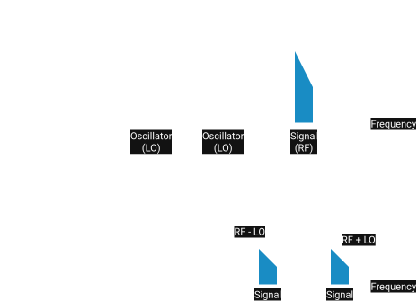

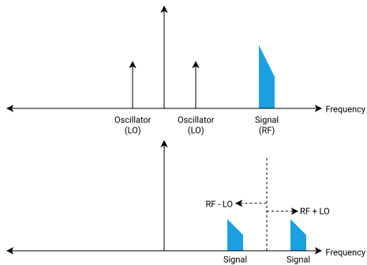

In the case of a digital mixing process, we can use a complex oscillator. This eliminates the negative copy of
the oscillator, resulting in one full-strength shifted copy of the input spectrum in the output, i.e. at ``RF + LO``.

Linear Convolution
~~~~~~~~~~~~~~~~~~

Borealis applies digital filters using linear convolution. This process involves multiplying the input signal sequence
by a reversed and shifted filter sequence. Each output of the linear convolution corresponds to a unique shift of the
filter sequence. For an input signal of length :math:`N` and filter of length :math:`M`, the output will be of length
:math:`N+M-1`, as for the first and last few output samples the filter is "hanging off" the input sequence and only a
partial overlap of the sequences contributes to the output. These "hanging off" output samples are discarded by Borealis,
as they have an artifically small magnitude due to fewer samples contributing to them. As a result, only :math:`N-M+1`
output samples are computed.

Filtering Stages
----------------

Borealis provides the capability to customize digital filters per experiment. However, sensible defaults
have been chosen for a 5 MHz input rate and 3.333 kHz output rate. Filter stages are specified with filter taps (samples)
and a downsampling rate. Each stage should use a lowpass filter, if you are customizing your own filter.
All filtering is done in the time domain.

The first stage lowpass filter is frequency-translated up to the mixing frequency, creating a bandpass filter that
simultaneously mixes the filter output to baseband. This is detailed more explicitly in `Modified Frerking Method`_.
Multiple mixing frequencies can be used simultaneously, creating multiple output datasets, one per mixing frequency.

The data is run through these frequency-translating bandpass filters to create multiple baseband output spectra,
one for each filter frequency. This is done in one algorithm using the modified Frerking method described below in
`Modified Frerking Method`_ and at :ref:`frerking`.

Following the bandpass-mixing filter, one stage of lowpass filtering and downsampling is conducted.
This stage is identical for all mixing frequencies.

As with most aspects of the Borealis system, there is freedom for customization of the filtering
stages. The filtering stages are stored in a :py:class:`DecimationScheme` class which is stored in the
experiment file. If no :py:class:`DecimationScheme` is provided, a default is used. Most Borealis experiments
use this default scheme, which is described in more detail below in `Default DecimationScheme`_.

A Jupyter notebook is included with the Borealis software for visualization and testing of filtering
schemes, using the filtering methods that run when a Borealis radar operates. This notebook can be
found at ``$BOREALISPATH/tests/dsp_testing/filters.ipynb``.

Default DecimationScheme
------------------------

The default :py:class:`DecimationScheme` for Borealis use two stages of digital filtering and downsampling to
reduce the data rate from 5 MHz to 3.333 kHz. The input sampling rate, downsampling rate, and output sampling rate
are shown for each stage in the table below.

+--------------+-------------+-------------------+-------------+----------------+
| Filter Stage | Input Rate  | Downsampling Rate | Output Rate | Number of Taps |
+==============+=============+===================+=============+================+
|      0       | 5 MHz       | 30                | 166.667 kHz | 499            |
+--------------+-------------+-------------------+-------------+----------------+
|      1       | 166.667 kHz | 50                | 3.333 kHz   | 34             |
+--------------+-------------+-------------------+-------------+----------------+

For a typical sequence of *normalscan* data, the input data to the first filter stage contains
around 450000 complex data samples for each antenna. After the first stage, this has been reduced to
around 15000 samples per antenna, but if multiple frequencies are being selected, there will be one copy of
(:math:`num\_channels`, 15000) for each frequency. After the second stage, the number of samples is
reduced from 15000 to around 300. The number of samples in and out of each stage does not exactly correspond to
the downsampling rate, due to the removal of edge effects in the linear convolution.

Modified Frerking Method
------------------------

The Frerking method is used to extract a narrow frequency band from a wideband spectrum. The method is
identical to the traditional multi-step approach of mixing an incoming signal with an oscillator to
bring the desired frequency to baseband, then running it through a low-pass filter.

Mixing a signal with an oscillator is just multiplying the signal with the oscillator value as the
signals are coming in. We use a complex exponential oscillator (not a cosine).
To reduce the number of computations, the complex exponential sequence is multiplied into the filter coefficients.
Then, the filter is applied to the wideband samples, which simultaneously applies a bandpass filter and mixes
the output to baseband. Lastly, a corrective phase is applied to the output samples, to compensate for the
oscillator sequence not evolving in phase since it is multiplied into the filter coefficients. In an analog system,
as samples arrive, they are multiplied by the oscillator value at the moment they arrive. However, with Borealis we are
mixing the filter sequence, rather than the input samples. We mix the oscillator with the filter once, then convolve
the input samples with the filter. The top curve in Figure 4 depicts the numerical oscillator sequence that gets mixed
with the filter sequence. As the filter sequence "slides" along the input samples, the phase is not consistent with an
equivalent analog mixing system.

As the filter "slides" along the samples, we are effectively getting a different window of the input
samples. The curves in Figure 4 depict the analog mixer sequence for each windowed view of the input
samples (the legend corresponds to the output sample number). In Borealis, there is only one mixer
sequence - the top (blue) curve. As we convolve with the filter and "slide" along the input samples, we then have a
phase difference between Borealis and its equivalent analog system. This difference is fairly simple
to correct. If the oscillator has phase :math:`{\phi}_0 = 0` when it mixes with the zeroth sample,
then it will have phase :math:`\phi_1 = 2\pi\frac{f_o}{F_s}` when it mixes with the first sample,
:math:`\phi_2 = 2\pi\frac{f_o}{F_s}2` when it mixes with the second sample, and so on. The general
formula is :math:`\phi_k = 2\pi\frac{f_o}{F_s}k`, where :math:`f_o` is the oscillator frequency,
:math:`F_s` is the data sampling rate, and :math:`k` is the index of the newest sample. Borealis
applies this correction after applying the filter and downsampling, to reduce the number of
mathematical operations. So, for a downsampling rate of :math:`R`, the phase correction for sample
:math:`k` after downsampling is :math:`\phi_k = 2\pi\frac{f_o}{F_s}Rk`.

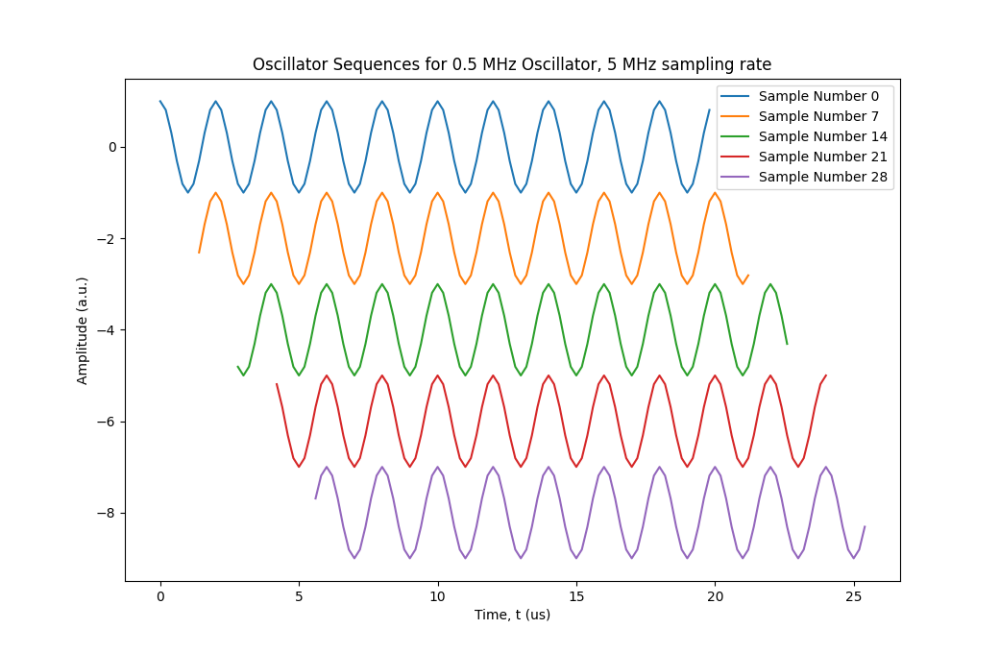

   Figure 4: Oscillator sequence evolution with sample number

Standard Filters
----------------

As mentioned previously, Borealis uses a two-stage filter. These filters are shown in Figures 5 and 6.

The first stage of filtering uses the Frerking method to simultaneously filter and mix to baseband.
The passband center frequency of the filter is configurable, and changes automatically to match the
frequency used in the experiment. Figure 5 shows the first stage of filter, before being mixed to become a bandpass filter.
After this stage, the samples are downsampled by a factor of 30, passed through the lowpass filter
shown in Figure 6, then finally dowsampled again by a factor of 50, which yields the ``antennas_iq`` dataset.

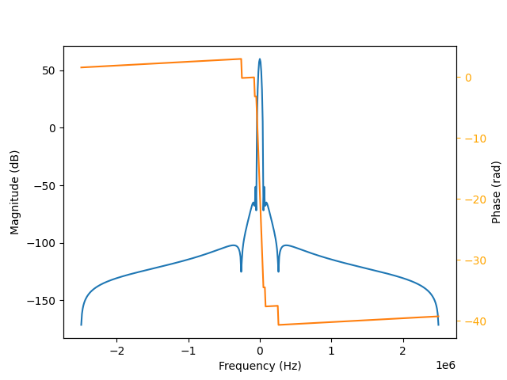

   Figure 5: First Stage Frequency Response

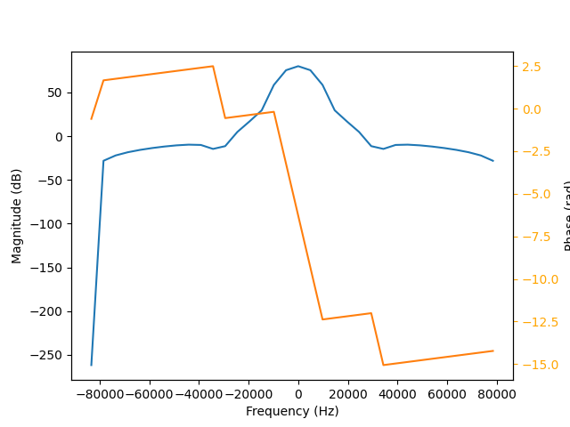

   Figure 6: Second Stage Frequency Response

The combination of these two filters stages can be modelled as well, showing the total frequency response of the
filtering scheme. Figure 7 shows this, for a first stage that is not mixed away from baseband. The central peak
is approximately 130 dB above the largest side lobes, providing ample isolation.

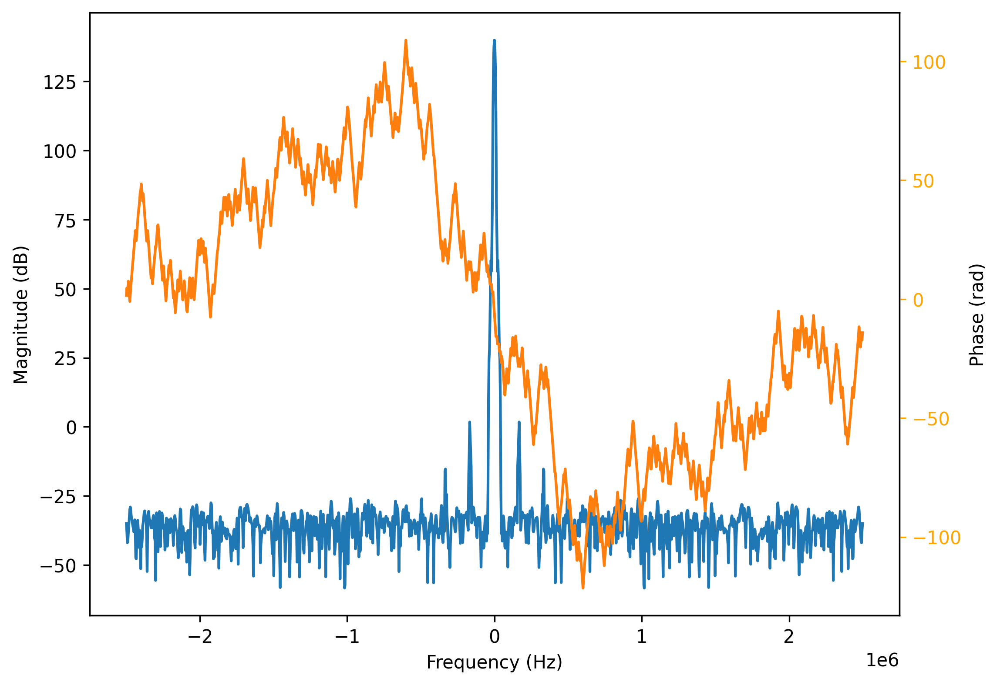

   Figure 7: Combined frequency response of filtering scheme

One thing to note is the sampling bandwidth of the data directly from the USRPs. Borealis specifies
a receive frequency band to the USRPs, and all data lies within that band. Ordinarily, this band is
defined by a bandwidth of 5 MHz centered around 12 MHz, for a total range of 9.5-14.5 MHz. If one
were to plot the FFT of the data, the FFT frequencies will take the range of (-2.5 MHz, 2.5 MHz). If
the transmitted signal was at 10.5 MHz, we then expect to see it in our received samples at (12.0
MHz - 10.5 MHz) = -1.5 MHz. Figure 8 shows exactly this situation.

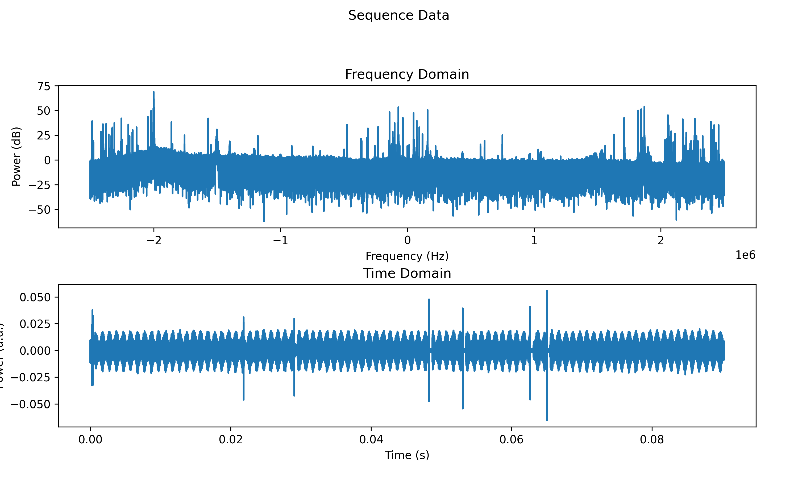

   Figure 8: Sample sequence of raw data from 10.5 MHz transmitted signal

-----------
Beamforming
-----------

Beamforming in Borealis is relatively straightforward. Figure 9 illustrates the
physical process, with the red antennas signifying the main array, the thick blue line being the
incoming plane wavefront, and the beam direction off of boresight shown by :math:`\theta`. For an incoming wave,
we can see that it will hit the leftmost antenna (antenna 0) first, then antenna 1, antenna 2, and
so forth, reaching antenna 15 last. Each antenna :math:`n` is going to measure a different phase of
the wave, determined by its distance from the reference wavefront :math:`d_n` as shown in the figure.
The required phase shift can be calculated from the geometry of the diagram as

.. math:: \phi_n = \frac{d_n}{\lambda} 2\pi

The filtered samples for a given antenna are multiplied by :math:`\phi_n` to correct their phase,
then the samples for all antennas are summed together to yield one dataset for the linear array.

In Borealis, the reference wavefront is taken chosen when the wavefront crosses the array axis at boresight, i.e.
the origin of the shown coordinate system. This means that the distances
:math:`d_n` for antennas 0 through 7 will be negative, since the wavefront will have passed them already.
The distance from the reference wavefront for an antenna and beam angle :math:`\theta` is then

.. math:: d_n = (n-\frac{N}{2})L\sin(\theta)

where :math:`n` is the antenna index, :math:`N` is the total number of antennas in the array, and
:math:`L` is the uniform antenna spacing. Plugging this result into the previous formula yields a
final formula of

.. math:: \phi_n = \left(\frac{L}{\lambda}(n-\frac{N}{2})\sin(\theta)\right) 2\pi

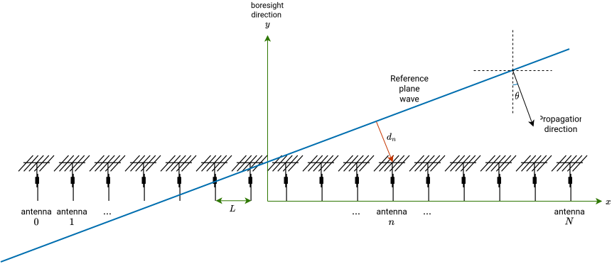

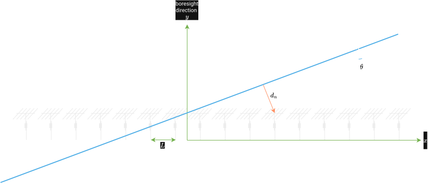

   Figure 9: Geometry of 1-D phased array beamforming

-----------
Correlating
-----------

Once beamforming has been completed, the data is correlated to analyze the time evolution of signals
scattered from the ionosphere. If only the main array is used, then the samples from that array are autocorrelated.
If the interferometer is also used, the interferometer samples are autocorrelated, and the main and
interferometer samples are cross-correlated. The process is the same for all correlations, and is
described with the aid of Figure 9.

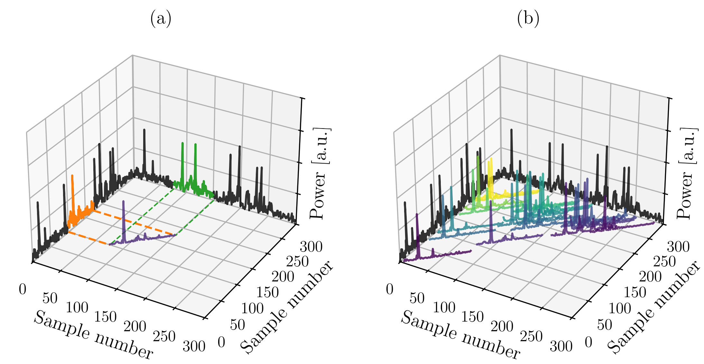

   Figure 10: (a) Single lag of data extracted and correlated; (b) All lags correlated, coloured from zero lag (purple) to maximum lag (yellow).

In Figure 10a, two sequences of data are shown on the axes of the plot. These could be sequences from
the main array or the interferometer array. A subsequence of data is extracted from one sequence (shown in orange),
corresponding to all delays of interest (i.e. range gates) after a pulse is transmitted. From the other sequence, a
similar subsequence is extracted (shown in green), however possibly from after a different pulse in the pulse train.
The green subsequence is complex-conjugated, then multiplied with the orange sequence point-wise. The result is shown
in purple. Note that only magnitudes of these complex numbers are shown for the purposes of this plot.
In Figure 10b, every possible combination of pulses in the pulse train have had subsequences extracted and multiplied,
with the results colour-coded by the delay between the two pulses extracted. Purple corresponds to zero delay (lag zero),
and the colour cycles through to yellow for the maximum delay.

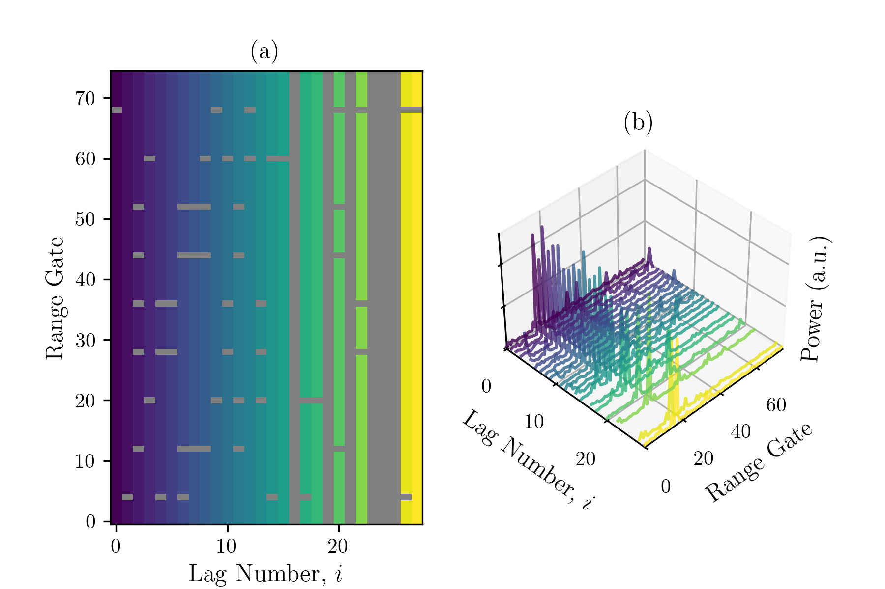

   Figure 11: (a) Blanked values of range-lag; (b) data from Figure 10b arranged by range gate and lag.

Figure 11b takes the output products from Figure 10b, and orders them by delay (or "lag"). Here, it is easy to see that there
is one range gate with a large magnitude of signal, corresponding to backscatter from some target. Over an averaging period,
typically 30-40 pulse sequences are collected, and the data shown in Figure 11b is from all 30-40 pulse sequences that are averaged
together. This result is then stored in a RAWACF file, correlation products for all range gates and lag values.
Figure 11a shows a top-down view, where lag increases on the x-axis, and range gate increases on the y-axis.
Grey boxes indicate range-lag combinations where a pulse was transmitted at that time, so the data is
contaminated by transmitter leakage and transmit/receive switching. The vertical grey lines are lags which
are not possible for the pulse sequence, as no pulses are separated by that delay. For a different pulse sequence,
the blanks and missing lags would be arranged differently, and the maximum lag value could be larger.
The `Build Your Own Borealis Experiment <https://superdarn.ca/byobe>`_ page can be used to play around with the location
of pulses in a pulse sequence and the resulting lag values that can be used.
