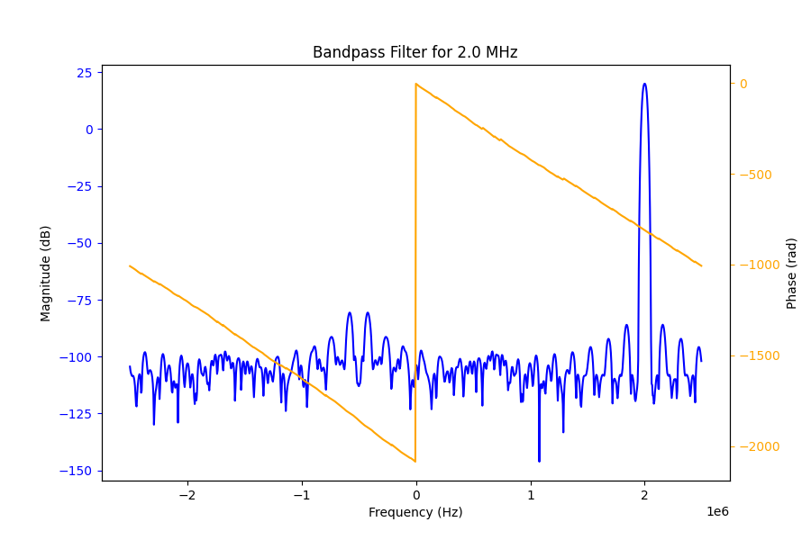

.. _dsp-chain-label:

============================================
Walkthrough of the Borealis Processing Chain
============================================

---------
Filtering
---------

Filtering Stages
----------------

The Borealis processing chain uses a staged-filter approach with staged downsampling, allowing for
multi-frequency filtering in real time. Using numpy arrays and array operations, the broadband input
spectrum received from the N200 devices can be filtered simultaneously into multiple datasets
centered on different frequencies. The data is first run through frequency-translating bandpass
filters to create multiple baseband output spectra, one for each filter frequency. This is done in
one algorithm using the modified Frerking method described in Section `Modified Frerking Method`_
and at :ref:`frerking-label`.

Following the bandpass-mixing filter, three stages of lowpass filtering and downsampling are done.
These stages are identical for all mixing frequencies.

As with most aspects of the Borealis system, there is freedom for customization of the filtering
stages. The filtering stages are stored in a DecimationScheme class which is stored in the
experiment file. If no DecimationScheme is provided, a default is used. Most Borealis experiments
use this default scheme, which will be described in more detail below in Section `Default
DecimationScheme`_.

A Jupyter notebook is included with the Borealis software for visualization and testing of filtering
schemes, using the filtering methods that run when a Borealis radar operates. This notebook can be
found at ``$BOREALISPATH/tests/dsp_testing/filters.ipynb``.

Default DecimationScheme
------------------------

The default DecimationScheme for Borealis uses a 4-stage filter and downsampling to reduce the data
rate from 5 MHz to 3.333 kHz. The input sampling rate, downsampling rate, and output sampling rate
are shown for each stage in the table below.

+--------------+------------+-------------------+-------------+----------------+
| Filter Stage | Input Rate | Downsampling Rate | Output Rate | Number of Taps |
+==============+============+===================+=============+================+
|      0       | 5 MHz      | 10                | 500 kHz     | 661            |
+--------------+------------+-------------------+-------------+----------------+
|      1       | 500 kHz    | 5                 | 100 kHz     | 127            |
+--------------+------------+-------------------+-------------+----------------+
|      2       | 100 kHz    | 6                 | 16.667 kHz  | 27             |
+--------------+------------+-------------------+-------------+----------------+
|      3       | 16.667 kHz | 5                 | 3.333 kHz   | 4              |
+--------------+------------+-------------------+-------------+----------------+

For a typical sequence of *normalscan* data, the input data to the first filter stage contains
451500 complex data samples for each antenna. After the first stage, this has been reduced to 45084
samples per antenna, but if multiple frequencies are being selected, there will be one copy of
(:math:`num\_antennas`, 45084) for each frequency. After the second stage, the number of samples is
reduced from 45084 to 8992. The next stage reduces it again to 1495 samples. Lastly, the final stage
reduces the data length to 299 samples. The number of samples in and out of each stage does not
exactly correspond to the downsampling rate; this will be explained shortly, as a result of the
filtering technique.

All Borealis signal processing is done in the time domain. The following figures illustrate the
process for a hypothetical 10-sample dataset and 3-tap filter.

Figure 1 shows the dataset :math:`x` and the filter taps :math:`h`. For all stages of filtering,
:math:`x` is much longer than :math:`h`, by three to four orders of magnitude.

   Figure 1: Graphical depiction of a data sequence and filter sequence

Figure 2 shows the process of linear convolution of :math:`h` with :math:`x`. The sequence :math:`h`
is flipped, then slid along :math:`x` and multiplied element-wise. At each position, the sum of the
element-wise multiplication is the output sample, call it :math:`y[n]`. We can see that the sequence
:math:`y` will be longer than :math:`x`. The length of :math:`y` is equal to the length of :math:`h`
plus the length of :math:`x`, minus one. However, the samples of :math:`y` for which :math:`h` was
"hanging off" of :math:`x` exhibit undesirable edge effects. In Borealis, these samples are dropped.
Thus, the first sample of :math:`y` corresponds to the third iteration shown in Figure 2, and
similarly the last sample kept is the third-last sample in the convolution. In general, the number
of dropped samples at each the start and end of the convolution is equal to the filter length minus
one. The dropping of samples can be seen in Figure 3.

To speed up the processing, downsampling in Borealis is done in the convolution step. This is done
by sliding :math:`h` in steps of the downsampling rate, as shown in Figure 3. This is mathematically
equivalent to taking the linear convolution then downsampling, but is computationally faster.

   Figure 2: Linear convolution of two sequences

   Figure 3: Linear convolution and downsampling, with filter roll-off samples dropped

Modified Frerking Method
------------------------

The Frerking method is used to extract a narrow frequency from a wideband spectrum. The method is
identical to the traditional multi-step approach of mixing an incoming signal with an oscillator to
bring the desired frequency to baseband, then running it through a low-pass filter.

Mixing a signal with an oscillator is just multiplying the signal with the oscillator value as the
signals are coming in. Since we gather complex samples, we use a complex oscillator (a complex
exponential instead of a cosine). To accomplish this in one (actually two) step(s), the complex
exponential is multiplied into the filter coefficients. Then, the wideband samples are passed
through the filter, which simultaneously mixes the samples and low-pass filters them. However, there
is still one more detail to resolve (the second step). In an analog system, the phase of the
oscillator changes over time, as might be obvious from the name "oscillator". So, as samples arrive,
they are multiplied by the oscillator value at the moment they arrive. However, with Borealis we are
mixing with the filter sequence, rather than the input samples (less multiplications). We mix the
oscillator with the filter once, then run the input samples through the filter. The top curve in
Figure 4 depicts the numerical oscillator sequence that gets mixed with the filter sequence. As the
filter sequence "slides" along the input samples, the phase is not consistent with an equivalent
analog mixing system.

As the filter "slides" along the samples, we are effectively getting a different window of the input
samples. The curves in Figure 4 depict the analog mixer sequence for each windowed view of the input
samples (the legend corresponds to the output sample number). In Borealis, there is only one mixer
sequence - the top curve. As we apply the filter and "slide" along the input samples, we then have a
phase difference between Borealis and its equivalent analog system. This difference is fairly simple
to correct. If the oscillator has phase :math:`{\phi}_0 = 0` when it mixes with the zeroth sample,
then it will have phase :math:`\phi_1 = 2\pi\frac{f_o}{F_s}` when it mixes with the first sample,
:math:`\phi_2 = 2\pi\frac{f_o}{F_s}2` when it mixes with the second sample, and so on. The general
formula is :math:`\phi_k = 2\pi\frac{f_o}{F_s}k`, where :math:`f_o` is the oscillator frequency,
:math:`F_s` is the data sampling rate, and :math:`k` is the index of the newest sample. Borealis
applies this correction after applying the filter and decimating, to reduce the number of
mathematical operations. So, for a downsampling rate of :math:`R`, the phase correction for sample
:math:`k` after downsampling is :math:`\phi_k = 2\pi\frac{f_o}{F_s}Rk`.

   Figure 4: Oscillator sequence evolution with sample number

Standard Filters
----------------

As mentioned previously, Borealis uses a four-stage filter approach with staged downsampling. These
filters are shown in Figures 5, 6, 7, and 8.

The first stage of filtering uses the Frerking method to simultaneously filter and mix to baseband.
The passband center frequency of the filter is configurable, and changes automatically to match the
frequency used in the experiment. Figure 5 shows the first stage of filter, with a passband centered
around 0.5 MHz. Figure 9 shows the same stage, but for a different center frequency of 2.0 MHz.
After this stage, the samples are decimated by a factor of 10 then passed through the lowpass filter
shown in Figure 6. The data is then decimated again by a factor of 5, then passed through the filter
shown in Figure 7. Another decimation by a factor of 6, passed through the filter in Figure 7, then
a final decimation by a rate of 5 yields the antennas IQ dataset.

   Figure 5: 0.5 MHz Bandpass Filter Frequency Response

   Figure 6: Stage 1 Lowpass Filter Frequency Response

   Figure 7: Stage 2 Lowpass Filter Frequency Response

   Figure 8: Stage 3 Lowpass Filter Frequency Response

   Figure 9: 2.0 MHz Bandpass Filter Frequency Response

One thing to note is the sampling bandwidth of the data directly from the USRPs. Borealis specifies
a receive frequency band to the USRPs, and all data lies within that band. Ordinarily, this band is
defined by a bandwidth of 5 MHz centered around 12 MHz, for a total range of 9.5-14.5 MHz. If one
were to plot the FFT of the data, the FFT frequencies will take the range of (-2.5 MHz, 2.5 MHz). If
the transmitted signal was at 10.5 MHz, we then expect to see it in our received samples at (12.0
MHz - 10.5 MHz) = -1.5 MHz. Figure 10 shows exactly this situation.

   Figure 10: Sample Sequence of raw data from 10.5 MHz transmitted signal

-----------
Beamforming
-----------

Beamforming in Borealis is relatively straightforward. Figure 11 illustrates the
physical process, with the red antennas signifying the main array, the thick black line being the
incoming plane wavefront, the parallel green lines indicating planar wavefronts at spacings of one
wavelength, and the beam direction off of boresight shown by :math:`\theta`. For an incoming wave,
we can see that it will hit the leftmost antenna (antenna 0) first, then antenna 1, antenna 2, and
so forth, reaching antenna 15 last. Each antenna :math:`n` is going to measure a different phase of
the wave, determined by its distance from the wavefront :math:`d_n` as shown in the figure. Due to
:math:`2\pi` ambiguity, the relevant phase correction is the phase required to get from the antenna
to the closest green line. The required phase shift can be calculated from the geometry of the
diagram as

.. math:: \phi_n = \frac{d_n}{\lambda} 2\pi

The filtered samples for a given antenna are multiplied by :math:`\phi_n` to correct their phase,
then the samples for all antennas are summed together to yield one dataset for the linear array.

The final wrinkle to this process is in the positioning of the wavefront. In Borealis, it is assumed
that the wavefront crosses the array axis at boresight, i.e. between antennas 7 and 8 where the
dotted line intersects the array axis. This means that the distances :math:`d_n` for antennas 0
through 7 will be negative, since the wavefront will have passed them already. With this last detail
considered, we can formulate the phase correction for a given beam angle :math:`\theta`. The result
is

.. math:: d_n = (n-\frac{N}{2})L\sin(\theta)

where :math:`n` is the antenna index, :math:`N` is the total number of antennas in the array, and
:math:`L` is the uniform antenna spacing. Plugging this result into the previous formula yields a
final formula of

.. math:: \phi_n = \left(\frac{L}{\lambda}(n-\frac{N}{2})\sin(\theta)\right) 2\pi

   Figure 11: Geometry of 1-D phased array beamforming

-----------
Correlating
-----------

Once beamforming has been completed, the data is correlated to analyze the time evolution of signals
scattered from the ionosphere. For each sequence, Borealis computes either one or three
correlations. If only the main array is used, then the samples from that array are autocorrelated.
If the interferometer is also used, the interferometer samples are autocorrelated, and the main and
interferometer samples are cross-correlated. The process is the same for all correlations, and is
described with the aid of Figure 12.

   Figure 12: Correlation matrix with blanked samples removed and lag samples extracted

In Figure 12, the array samples are shown outside of the correlation, as the sequences :math:`x` and
:math:`y^*`. For autocorrelation, :math:`x = y`, and for cross-correlation they are different, but
always of the same length in Borealis. Grey samples are "blanked" samples, which occur when the
radar is transmitting data. These samples are later disregarded, as the Borealis transmitters block
ionospheric signals during transmit times. The 2-D matrix is the multiplication (outer product) of
the two sequences. In this example, there are five range gates that we need data for, with the first
range gate being one "sample" away from the radar, i.e. the range is half as far away as the
distance light can travel in one unit of the sample spacing. The other useful time quantity required
for this process is the lag spacing, denoted by :math:`\tau`. This is the common factor in all lag
pairs of the data, which for this example is three samples, as pulses occur at :math:`x[0]` and
:math:`x[3]`. We are interested in how the data is correlated in units of :math:`\tau`, for all
ranges. To determine this, we correlate the data, and extract the correlations for all lags at all
ranges. The purple samples in the correlation matrix are the correlations for lag-0 for the five
ranges, with the closest range being :math:`x[1]y^*[1]` and the furthest range :math:`x[5]y^*[5]`.
The orange samples represent the correlations for lag-1 for the same ranges. This data represents
lag-1 as the samples are the correlation of data from :math:`x` and :math:`y` which occur
:math:`\tau` seconds apart (three samples). Figure 13 shows the same style of diagram for a typical
SuperDARN 7-pulse sequence, with 75 range gates, a tau spacing of 8 samples, and the first range
occurring four samples after a pulse.

   Figure 13: Borealis correlation matrix
