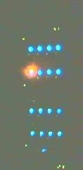

Common Failure Modes
====================

Certain failures of the Borealis system can be generally attributed to a short list of common issues.

N200 Power loss
---------------
If the power to any N200 device that Borealis is currently using is disrupted for a brief time,
then the symptoms are typically:

    - Driver message: "Timed out! RuntimeError fifo ctrl timed out looking for acks"
    - The N200 that lost power will have all front panel aftermarket LEDs ON
    - All other N200s will have the green RX LED ON.
    - Radar stops

Restart the radar by:

    - Ensuring the power is securely connected to all N200s
    - `/borealis/stop_radar.sh`
    - `/borealis/start_radar.sh`

N200 10MHz reference loss
-------------------------
If the 10MHz reference signal to any N200 device that Borealis is currently using is disrupted for
an extended time (beyond a few seconds) then the symptoms are:

    - Continual 'lates' from the driver ('L' printed out continuously)
    - `REF locked` front panel LED will be off for the N200 that lost 10MHz reference
    - Upon reconnection of the 10MHz signal, the lates continue
    - Radar continues

Restart the radar by:

    - Ensuring the 10MHz reference is connected to all N200s
    - `/borealis/stop_radar.sh`
    - `/borealis/start_radar.sh`

N200 PPS reference loss
-----------------------
If the Pulse Per Second (PPS) reference signal to any N200 device that Borealis is currently using
is disrupted for an extended time (beyond a few seconds) then the symptoms are:

    - None

N200 Ethernet loss
------------------
If the ethernet connection to any N200 device that Borealis is currently using is disrupted for
a brief time, the symptoms are typically:

    - Borealis software hangs
    - After some time, the aftermarket front panel LEDS turn yellow, indicating an IDLE situation
    - Radar stops

Restart the radar by:

    - Reconnecting the Ethernet
    - `/borealis/stop_radar.sh`
    - `/borealis/start_radar.sh`

Borealis Startup with N200 PPS reference missing
------------------------------------------------
If the Pulse Per Second (PPS) reference signal to any N200 device that Borealis will use upon startup
is not connected, the symptoms are:

    - Driver initialization doesn't proceed past initialization of the N200s.

*NOTE* This is as expected as the driver is waiting for a PPS signal to set the time registers

Start the radar by:

    - Ensure PPS signal is connected to each N200

Octoclock GPS Power loss
------------------------
If the master Octoclock (octoclock-g) unit loses power, then it no longer supplies 10MHz and PPS
reference signals to the slave Octoclocks. The symptoms are:

    - Octoclock slaves lose PPS and external 10MHz references (only the `power` LED is ON)
    - All `ref lock` front panel LEDs on all N200s are OFF
    - Continual lates from the driver (may take a few minutes for this symptom to manifest)

Start the radar by:

    - Ensure Octoclock-g has power connected, and GPS antenna is connected
    - `/borealis/stop_radar.sh`
    - `/borealis/start_radar.sh`
    - The driver will wait for GPS lock before initializing the N200s and starting the radar.

*NOTE* This may take a long time, and depends upon many factors including the antenna view of satellites, how long the
octoclock-g has been powered off, temperature, etc. In testing it locked within 20 minutes.

Front panel LEDS show incorrect pattern but Borealis continues to run normally
------------------------------------------------------------------------------
On several occasions, one of the N200 devices has shown a front panel LED pattern that doesn't match
the expected pattern. The symptoms are:

    - The IDLE (Yellow) or TXo (RED) LED(s) are lit when they should not be
    - The N200 and Borealis system are operating normally

Here is an example image from a webcam photo of the Saskatoon SuperDARN Borealis rack where the IDLE
LED on N200 #4 is lit when it shouldn't be:

Fix this issue by:

    - Stop Borealis, disconnect the N200 exhibiting problems
    - Open the N200 case
    - Reseat the jumper wires supplying power to the LED in question
    - Ensure no LED wires/legs are shorting to anything, use electrical tape if you have to, or trim the LED legs shorter
    - Reconnect the N200, ensure that when power is connected, all four LEDS on the front panel light up
    - Start Borealis, ensure the problematic LED no longer lights up in normal operation

If this doesn't solve the issue, a further investigation into the TXIO board and daughterboard hardware is required

TXIO Cable disconnect from N200 or Transmitter
----------------------------------------------
If the cable carrying differential signals to/from the transmitters and the N200s is removed, or
has failed in some way, then some possible results are:

    - Transmitter will not transmit if the T/R signal is missing, this would be most obvious error
    - Transmitter Low Power and AGC Status signals may not be valid when read from the N200 GPIO
    - Transmitter may not be able to be placed into test mode

To fix this issue, ensure that all connectors are secured.

Shared memory full/Borealis unable to delete shared memory
----------------------------------------------------------
**NOTE** If you've just installed Borealis, this may be caused by a missing `h5copy` binary.
Make sure you have it installed for your operating system. For new versions of Ubuntu this means
installing `hdf5-tools`. For OpenSuSe it means installing `hdf5`.

This may also be caused by the realtime/datawrite modules not deleting the individual
record files. This is tied to issue [#203](https://github.com/SuperDARNCanada/borealis/issues/203),
so check that the individual record files in the data output directory are being deleted 
after being copied, and check the realtime logs to verify that realtime is running properly.

If the shared memory location written to by Borealis is full, or the shared memory files are unable
to be deleted by Borealis, then some possible results are:

    - N200's may be in RX only mode (green LED on front panel will be on only)
    - Borealis may appear to halt when viewing the screen, or Borealis may be getting very 
      few sequences transmitted per integration time (1-2 within seconds)
    - Signal processing may quietly die
    - Data files, shared memory files and log files will cease being written

To fix this issue and restart the radar:
    - Make sure the `h5copy` binary is installed for your system
    - remove all Borealis created files in the `/dev/shm` directory
    - `/borealis/stop_radar.sh`
    - `/borealis/start_radar.sh`

remote_server.py Segfaults, other programs segfault (core-dump)
---------------------------------------------------------------
This behaviour has been seen several times at the Saskatoon Borealis radar.
The root cause is unknown, but symptoms are:

    - Radar stops with nothing obvious in the logs or on the screen session
    - Attempting to start the radar with `start_radar.sh` results in a segfault
    - Attempting to reboot the computer results in segfaults, bus errors, core dumps, etc
    
To fix this issue and restart the radar:
    - Power cycle the machine

'CPU stuck' messages from kernel, not possible to reboot
--------------------------------------------------------
This behaviour has been seen once at the Clyde River Borealis radar. The message shown is:

`Message from syslogd@clyborealis at Jun 15 00:47:18 ... kernel:[9941421.042914] NMI watchdog: BUG:
soft lockup - CPU#19 stuck for 22s! [kworker/u56:0:16764]`

The root cause is unknown, but symptoms are:

    - Radar stops with the same message across all screens and terminals from the kernel
    - Attempting to reboot the computer results in nothing happening etc

To fix this issue and restart the radar:
    - Power cycle the machine

Protobuf library is not working
-------------------------------
Symptoms: The following error in one or more screens when attempting to run the radar.

`Traceback (most recent call last):
  File "brian/brian.py", line 24, in <module>
    import driverpacket_pb2
  File "/home/radar/borealis//build/release/utils/protobuf/driverpacket_pb2.py", line 5, in <module>
    from google.protobuf.internal import builder as _builder
ImportError: cannot import name 'builder'`

Reason:
There are two components to the protobuf installation - the package and the protoc compiler.
Starting with version 3.20.0, the builder.py file was made for consolidation with this library, 'Protobuf python generated codes are simplified. Descriptors and message classes' definitions are now dynamic created in internal/builder.py.'
See https://github.com/protocolbuffers/protobuf/releases?page=2
We have had troubles installing versions newer than this, so we recommend using previous versions.

Solution:
Either upgrade your protobuf version or install an older version of the protoc compiler.

Number of sequences per integration time decreasing over time
-------------------------------------------------------------
This behaviour has been seen when setting up Borealis on new computers. Typically the radar starts
and records 30-32 sequences per integration, but over the span of a half hour or more may decrease
down to 10-20 sequences per integration.

This is caused by a communication error between the brian and realtime modules, likely due to the
value of `realtime_address` in config.ini. Make sure that the realtime_address uses a configure
interface that is "UP". See Software Setup for instructions.

Borealis only takes runs one integration time then stops
--------------------------------------------------------
This is an unresolved issue, which seems to be caused by the Signal Processing module. Restarting
borealis sometimes fixes it, but you may need to restart multiple times.

ZMQError in realtime module
---------------------------
This behaviour has been seen when setting up Borealis on new computers. The following error message
is displayed::

    Traceback (most recent call last):
      File "realtime/realtime.py", line 113, in <module>
        _main()
      File "realtime/realtime.py", line 39, in _main
        realtime_socket.bind(opts.rt_address)
      File "/home/radar/borealis/borealisrt_env/lib64/python3.6/site-packages/zmq/sugar/socket.py", line 172, in bind
        super().bind(addr)
      File "zmq/backend/cython/socket.pyx", line 540, in zmq.backend.cython.socket.Socket.bind
      File "zmq/backend/cython/checkrc.pxd", line 28, in zmq.backend.cython.checkrc._check_rc
    zmq.error.ZMQError: No such device

The reason for the error is due to improper configuration of the `realtime_address` in config.ini.
Instructions for proper configuration can be found in the Software Setup section.

No module named 'deepdish'
__________________________
This behaviour has been seen when setting up Borealis on new computers. DeepDish is a library for
reading/writing hdf5 files, which is used by the realtime module. Due to updates in the pyDARN
library, deepdish is no longer a dependency of pyDARN. The following error message in the realtime
screen is indicative of this error::

    Traceback (most recent call last):
      File "realtime/realtime.py", line 16, in <module>
        import pydarn
      File "/home/radar/borealis/borealisrt_env/lib/python3.6/site-packages/pydarn-2.1-py3.6.egg/pydarn/__init__.py", line 17, in <module>
        from .io.superdarn_io import SuperDARNRead
      File "/home/radar/borealis/borealisrt_env/lib/python3.6/site-packages/pydarn-2.1-py3.6.egg/pydarn/io/superdarn_io.py", line 5, in <module>
        import pydarnio
      File "/home/radar/borealis/borealisrt_env/lib/python3.6/site-packages/pydarnio-1.1.0-py3.6.egg/pydarnio/__init__.py", line 43, in <module>
        from .borealis.borealis import BorealisRead
      File "/home/radar/borealis/borealisrt_env/lib/python3.6/site-packages/pydarnio-1.1.0-py3.6.egg/pydarnio/borealis/borealis.py", line 46, in <module>
        from .borealis_site import BorealisSiteRead, BorealisSiteWrite
      File "/home/radar/borealis/borealisrt_env/lib/python3.6/site-packages/pydarnio-1.1.0-py3.6.egg/pydarnio/borealis/borealis_site.py", line 38, in <module>
        import deepdish as dd
    ModuleNotFoundError: No module named 'deepdish'

The Software Setup page has been updated with instructions on how to set up the borealisrt_env
virtual environment without encountering this error.

Error while loading shared library libncurses.so.5
--------------------------------------------------
This behaviour is seen when running borealis in `debug` or `engineeringdebug` modes.
Libncurses5 is a dependency of cuda-gdb. By default, the newest version of
libncurses is installed with cuda-gdb; however, libncurses6 doesn't seem to work
with the version of cuda-gdb used.

To fix this problem, install libncurses5 on your borealis computer. On OpenSuSe, this
can be done using `sudo zypper in libncurses5`.

nvcc fatal: Unsupported gpu architecture 'compute_xx'
-----------------------------------------------------
This error code is seen when building Borealis with a GPU that isn't supported by your
version of CUDA. The compute capability of the GPU can be found by running deviceQuery
and checking the version number given by the line:
    - CUDA Capability Major/Minor version number:    7.5

In this case, the compute_xx number is 75. You can see the supported compute_xx numbers
for your current CUDA version by running:
    - nvcc --help

and checking the versions listed under the option --gpu-code. Updating your CUDA version
should resolve this issue.