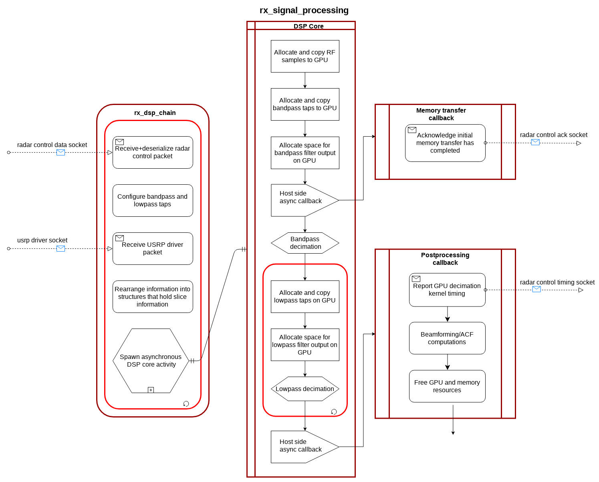
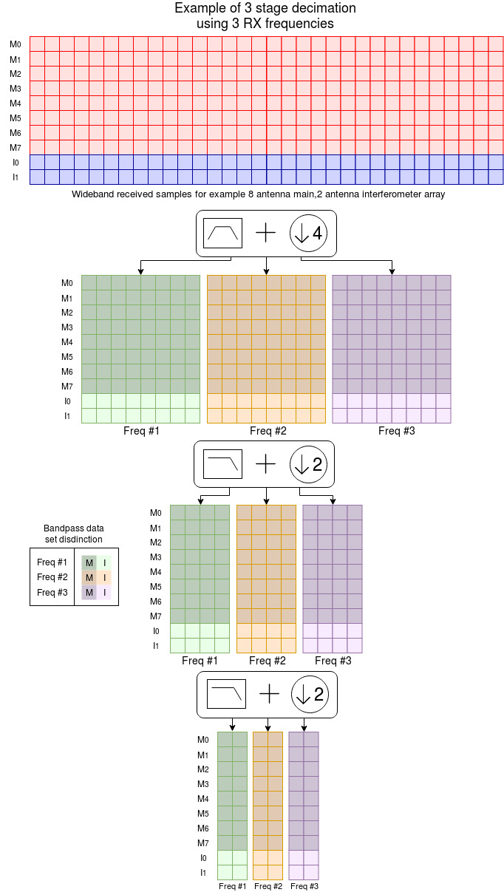

====================
RX Signal Processing
====================

The Borealis radar receive side signal processing is mostly moved into software using the digital
radar design. The RX DSP block is designed to utilize a GPU and threading in order to maximize
parallelism to be able to process as much data as possible in real-time.

Borealis experiments give lots of flexibility for filtering. Filter coefficients are generated as
part of decimation schemes at the experiment level. The DSP block receives the coefficients for
each stage of decimation from Radar Control. The DSP block has been designed to be able to run
as many decimation stages as are configured in the decimation scheme. This allows SuperDARN users
to have as much control as they want in designing filter characteristics.

   Block diagram of RX DSP software

Sampled data stored in shared memory is then opened, and operation of the GPU is configured. The GPU
programming is set up in an asynchronous mode, meaning that more than one `stream
<http://docs.nvidia.com/cuda/cuda-c-programming-guide/index.html#streams>`_ can run at once. The GPU
does not have enough computation resources to be able to process data from more than one sequence,
but in asynchronous mode data from one sequence can be copied to the GPU memory while another
sequence is being processed. Asynchronous mode also allows for a callback function that executes
when the stream is finished executing without interrupting operation of the main thread. GPU
operations works as follows:

    #. Memory is allocated on device to hold data for each stage of decimation.
    #. Parallelized filtering convolution calculations are performed for each stage.
    #. A callback function is run once the GPU is finished processing.

The GPU `stream callback
<http://docs.nvidia.com/cuda/cuda-c-programming-guide/index.html#stream-callbacks>`_ runs in a new
thread and copies the processed samples back to the host machine. The processed samples are then
sent to another process to be written to file. A final deconstructor is run that frees all
associated memory resources for the completed sequence.

Filtering convolutions involve many multiply and add operations over a set of data, and many of
these operations can be run concurrently. Key to understanding how GPU parallel processing occurs
requires reading and studying the `CUDA programming guide
<http://docs.nvidia.com/cuda/cuda-c-programming-guide/>`_. In this application, two different
kernels are used.

A bandpass filtering CUDA kernel is written to perform the convolutions and the GPU is configured
with a two dimensional grid of two dimension blocks. In this case there is a single input data set,
and one output data set for each frequency. The grid has a block for each decimated output sample by
number of antennas. Each block is made up of set of threads and there is a thread for each filter
coefficient by number of total filters. What this all means is that the GPU will attempt to process
as many output samples that the device can run at once. Each output sample calculation will have all
the multiplies and adds done concurrently for the filters for each frequency.

A lowpass filtering CUDA kernel is similar in operation, however since there is now potentially one
or more data sets that get individually decimated, the kernel dimensions get slightly changed. The
grid now adds a third dimension for frequency data set and the block now only has one set of threads
for a single lowpass filter.

   Diagram of Rx DSP data flow during decimation

DSP Class
---------

.. autoclass:: src.utils.signals.DSP
    :noindex:

See also
--------

.. toctree::
   :glob:
   :maxdepth: 1

   frerking.rst
   dsp_chain_in_detail.rst
