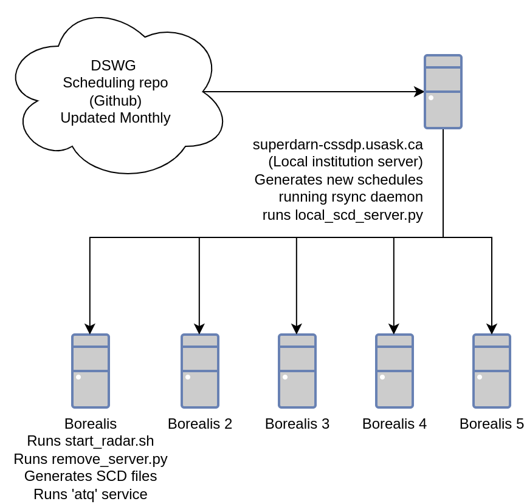

==========
Scheduling
==========

Borealis scheduling is made of several components to help automate and reduce overhead.
The idea here is to have a script that runs locally at the institution which generates
new schedules, which are then synchronized automatically to the radar sites,
and then a remote script on site that converts the schedules to actual radar commands.

The local script will monitor the Scheduling Working Group (SWG) web link for new uploads and then
grab them if there is anything new. At the time of writing, these files are hosted at
`<https://github.com/SuperDARN/schedules>`_. This automated script will then parse the lines from
the file and convert them to schedule file (SCD) commands.

The schedule files need to be synced to the radar sites. The SCD files that the local script adds to
should all be in this directory so that syncing is all automated. This syncing is currently done via
a daemon process (``scheduler_sync.daemon``) that continually watches the local files for changes
using inotify, then rsyncs the changed files to each site. If a schedule fails to sync, an alert is
sent to our group's Slack workspace to notify us. For more information on integrating Slack alerts,
see `here <https://www.howtogeek.com/devops/how-to-send-a-message-to-slack-from-a-bash-script/>`__. 

The remote script (``remote_server.py``) will check for changes to any synced files and then generate
``atq`` command arguments for Borealis experiments to run. This allows us to utilize scheduling
utilities already available in Linux.

These scripts are configured with logging and email capability so that maintainers can track if
scheduling is successful. There is also a utility script called ``schedule_modifier.py`` that should
be used to add or remove lines from the schedule so that no errors are made in the schedule file. It
is not recommended to manually modify any schedule files.

Here is a simple diagram for how scheduling works. It starts with the DSWG repository, which is
accessed via a local server, which then uses the scheduler sync daemon to sync with all Borealis
radars.

Here are the steps to configure scheduling:

1. Configure a local institution server to build schedules.

    - Git clone a copy of Borealis.
    - Configure scheduler sync daemon script to sync to the various Borealis radar computers.
    - Edit the ``local_scd_server.py`` with the correct experiments and radars belonging to your
      institution.
    - Configure a system service or reboot ``cron`` task to run the python3 script
      ``local_scd_server.py`` at boot. This script requires the argument ``--scd-dir`` for the
      schedules directory as well as ``--emails-filepath`` which should be a text file of emails on
      each line where scheduling status will be sent.
    - The ``local_scd_server.py`` script has an option for running manually the first time to
      properly configure the scheduling directory with the schedules for the latest files available.
    - Example: ::
        
        python3 ./local_scd_server.py --first-run --scd-dir=/data/borealis_schedules --emails-filepath=/data/borealis_schedules/emails.txt

2. Configure the Borealis computer.
        
    - Schedule a reboot task via ``cron`` to run the ``start_radar.sh`` helper script in order to
      run the radar according the radar schedule.
    - Enable and start ``atq`` service.

**Scheduler Code**

.. toctree::
   :glob:
   :maxdepth: 1

   scheduler_code.rst