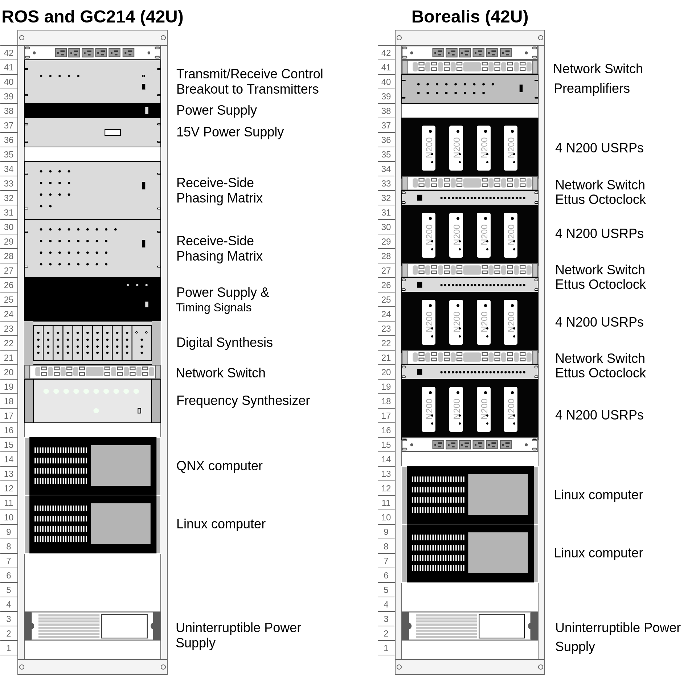
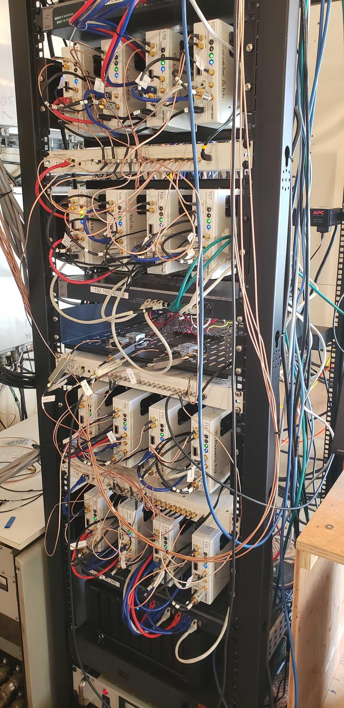
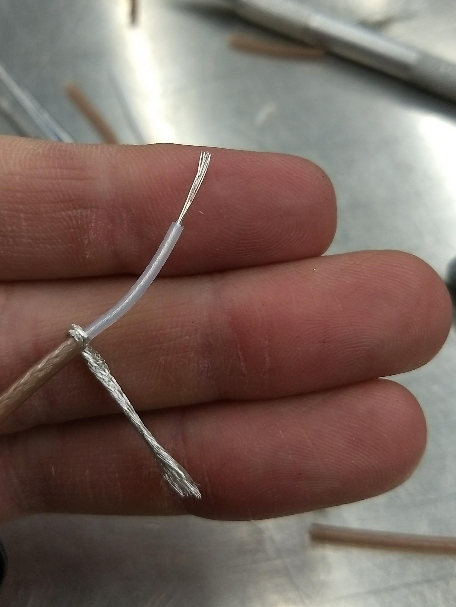
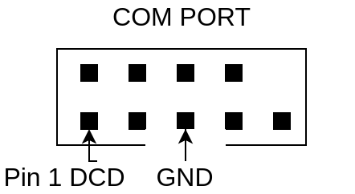
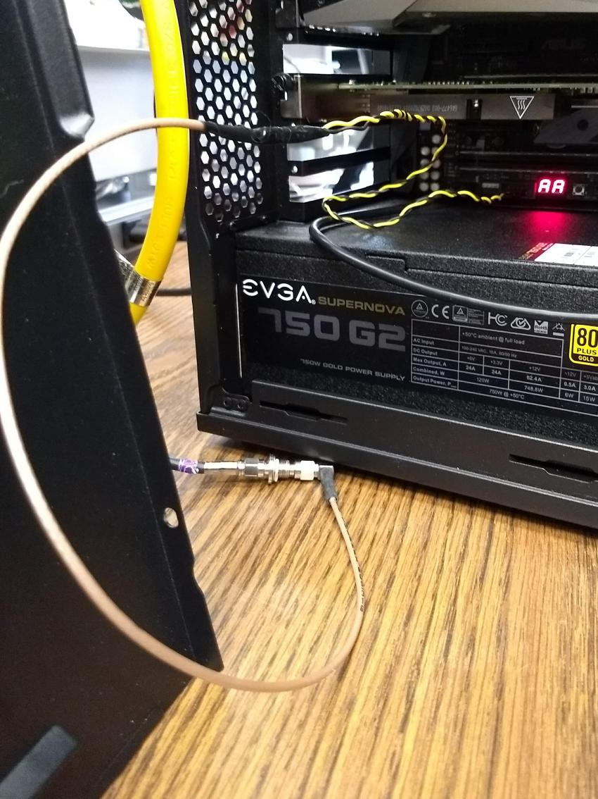
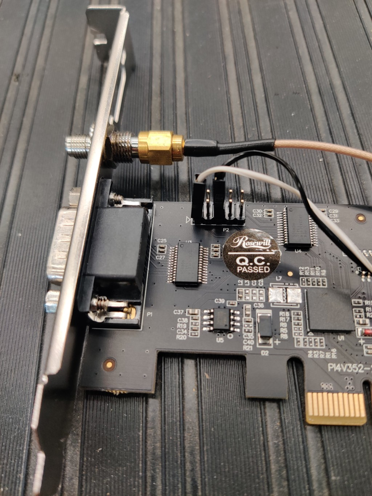

.. _hardware:

========
Hardware
========

------------------------------
System Overview and Rack Setup
------------------------------

Below is a recommended configuration in comparison to a common SuperDARN system, Note that the N200s
are in custom made shelves, but shelves can also be purchased from National Instruments:

Here is an actual rack configuration as installed by SuperDARN Canada at the Saskatoon (SAS)
SuperDARN site. Note that space has been allowed between the rackmount items to allow for cable
routing. There is a lot of cabling involved at the front of the devices.

The items installed in the rack at the Saskatoon site are listed below in order from top to bottom
in the rack:

- Netgear XS708E 10Gb switch **NOTE these are deprecated, new switches are in testing**
- USRP rackmount shelf (in-house design) with 4 x N200s
- Ettus Octoclock
- USRP rackmount shelf (in-house design) with 4 x N200s
- Netgear XS708E 10Gb switch
- Rackmount shelf with 4 x low-noise amplifiers for the interferometer array channels, and a
  terminal strip for power (supplied by 15V Acopian)
- Ettus Octoclock-G (with GPSDO)
- USRP rackmount shelf (in-house design) with 4 x N200s
- Ettus Octoclock
- USRP rackmount shelf (in-house design) with 4 x N200s
- Netgear XS708E 10Gb switch
- Synology Network Attached Storage device
- APC Smart UPS
- 15V Acopian power supply **(For the pre-amplifiers on the interferometer)**

In addition to these items, there are the following:

- 3 x APC PDUs (AP7900B) are mounted at the back of the rack
- 1x 5-port unmanaged network switch that can handle at minimum 10Mbps, 100Mbps link speeds
  (10BASE-T and 100BASE-T) for Octoclock networking **(This is only required if the network switches
  in use for the N200s do not support 10BASE-T)**
- The Borealis computer is not in a rackmount case, instead it is placed to the right of the rack.
- 16 x Mini-Circuits SLP-21.4 low pass filters on the TX outputs of each N200

-----
USRPs
-----

This guide assumes set up of a brand new, unopened Ettus N200.

Initial Test of the Unit
------------------------

*Install Daughterboards*

#. Open the unit and install the LFTX and LFRX daughtercards using hardware provided. The main USRP
   PCB is clearly marked with where to connect TX and RX daughterboards, and there is only one way
   they can fit while still allowing all the screw holes to line-up. The RX daughterboard is located
   directly above the fan power connection at the back of the motherboard.
#. Connect the output of TXA using an SMA cable to the custom-added SMA connection point on the
   front of the USRP using one of the SMA Male to female bulkhead SMA cables. Connect the output of
   RXA to RF1 and RXB to RF2 on the front of the USRP using two more SMA Male to female bulkhead
   cables.
#. Verify that the jumper J510 on the N200 motherboard is jumping the two 0.1" header pins furthest
   from the board edge. The jumper is located behind the CLK_REF (REF IN) SMA connector on the front
   of the N200. This ensures that the reference clock input is coming from the front-panel SMA
   connector, and not the secondary SMA connector located on the motherboard labeled 'J507 CLK_REF
   2'.

*Connect to the USRP*

#. USRPs have a default IP address of ``192.168.10.2``. Assign a computer network interface an
   address that can communicate in this subnet. Connect the USRP to the computer's network interface
   either directly or through one of the switches from the system specifications. Connect the USRP
   power supply. **NOTE that if you have multiple N200s connected at once on the same subnet with
   the same IP address, the behaviour is undefined, and weird problems will result**
#. Verify the board powers on and is discoverable. The USRP should be discoverable by pinging
   ``192.168.10.2``. Ettus' USRP UHD library supplies a tool called ``uhd_usrp_probe`` which should
   also be able to detect the device. See software setup for notes on installing UHD. The USRP may
   require a firmware upgrade.
#. In order to do loopback testing, and see the transmit waveform on an oscilloscope with the N200:
   Connect an SMA T connection (F-M-F) to the TX output from the front of the N200, connect another
   SMA T (F-M-F) to the first T. Connect one end of the second SMA T to RX1, and the other end to
   RX2 with phase matched SMA M-M cables. Connect the free SMA output of the first SMA T to the
   scope. Connect the Octoclock PPS and 10MHz reference signals to the USRP. Make sure that the
   jumper on J510 is in the rightmost position connecting the front panel 10MHz as the system
   reference.

*Test the USRP*

	Use the UHD utilities ``rx_samples_to_file``, ``tx_bursts`` and ``txrx_loopback_to_file`` to
	verify the USRP works. Use the scope to see the transmit signal. The RX samples will be a binary
	file that can be quickly read in a plotted with Numpy/Matplotlib. While testing, watch the front
	panel LEDs to see that they work as expected.

*Disassembly for Enclosure Modifications*

	If the USRP is working correctly, the inner motherboard, fan, daughtercards and RF cables can
	all be removed from the unit. Carefully peel the product sticker and store with the motherboard,
	this contains the MAC address, SN and PN of the unit. All removed components and the sticker can
	be stored in the anti-static bags that were supplied with the unit. The enclosure is ready for
	machining the additional holes. Ensure that you note which way the fan was installed for
	reinstallation later.

Custom Enclosure Modifications
------------------------------

*The custom machining involves the following machining steps*

#. Five extra SMA holes that are 'D' shaped to fit most standard SMA bulkhead connectors. Four of
   these holes are on the back of the N200, and one is on the front, in line with the two existing
   RF1 and RF2 SMA bulkhead holes.
#. A DSUB shaped hole for a DE9 connector at the rear of the unit for connection to existing
   SuperDARN transmitters.
#. Four holes for standard 5mm LED clips (6.35 +/-0.05mm diameter) with 9.5mm centers to
   appropriately space them.

Installing the Custom-Made TXIO Board
-------------------------------------

#. Once the enclosures are machined, the electronics and components can all be reinstalled. Place
   the product sticker back in place on the rear of the unit. There are slight indentations in the
   case to indicate where the product sticker goes. Connect RXA to port RF1, connect RXB to port
   RF2, and connect TXA to the additional front panel hole that was added.
#. Install the LEDs and their clips
    #. Insert the LED clips from the front of the N200.
    #. Insert the LEDs from the back into their respective clips. The order of the LED install
       patterns from left to right are: TX only indicator (RED), IDLE indicator (YELLOW), RX only
       indicator (GREEN) the TR indicator (BLUE). Push from both sides (on the LED and the clip)
       until the LED snaps into place.
    #. Slide the spacers over the LEDs from the back onto the clips. These spacers will hold the
       clips in place and prevent LEDs from popping back inside the N200 when pushed from the front.
       To make it easier to fit the spacers on the clips, stretch the spacers out to a slightly
       larger diameter. The easiest way to do this is to push the spacer onto a steel alignment
       punch using a 1/4" washer after warming up the spacer with a heat gun.
    #. Optional: add labels to each LED.

    .. image:: img/txio/txio_leds.jpg
       :scale: 50%
       :alt: LEDs installed with spacers
       :align: center

#. Install the fan, making sure to re-install it the same way it was originally installed.

    .. image:: img/txio/txio_fan_direction.jpg
       :scale: 50%
       :alt: Arrows indicate fan rotation and air flow direction
       :align: center

*Pre-Assemble the TXIO board before installation into the N200*

#. Begin by connecting eight 0.1" female-female jumper cables to pins 1-4 and 6-9 of the D-sub
   connector. The other ends of these wires connects to header J2 on the TXIO board

	+---------+-----------+-------------+----------+
	| J2 Pin  | Pin label | Wire colour | DSUB Pin |
	+=========+===========+=============+==========+
	| 1       | LP-       | Grey        | 4        |
	+---------+-----------+-------------+----------+
	| 2       | TM-       | Blue        | 3        |
	+---------+-----------+-------------+----------+
	| 3       | LP+       | Purple      | 9        |
	+---------+-----------+-------------+----------+
	| 4       | TM+       | Green       | 8        |
	+---------+-----------+-------------+----------+
	| 5       | GND       | [NC]        | [NC]     |
	+---------+-----------+-------------+----------+
	| 6       | GND       | [NC]        | [NC]     |
	+---------+-----------+-------------+----------+
	| 7       | AGC-      | Brown       | 1        |
	+---------+-----------+-------------+----------+
	| 8       | TR-       | Orange      | 2        |
	+---------+-----------+-------------+----------+
	| 9       | AGC+      | Red         | 6        |
	+---------+-----------+-------------+----------+
	| 10      | TR+       | Yellow      | 7        |
	+---------+-----------+-------------+----------+
	| [NC]    | [NC]      | [NC]        | 5        |
	+---------+-----------+-------------+----------+

    .. image:: img/txio/txio_dsub_fanpwr.jpg
       :scale: 50%
       :alt: TXIO dsub wire connections
       :align: center

    .. image:: img/txio/txio_lfrx_signals.jpg
       :scale: 50%
       :alt: TXIO lrfx signal connections
       :align: center

#. Connect the four U.Fl to SMA female bulkhead cables to J4, J5, J6 and J7 of the TXIO board.
   Orientation of the cables doesn't matter, as they will fit in the N200 case if rotated properly.

    .. image:: img/txio/txio_pcb_connections.jpg
       :scale: 50%
       :alt: TXIO PCB view
       :align: center

#. Connect 4 pairs of 0.1" female to female jumper wires to header J3 on the TXIO board. THe other
   ends will connect to the LEDs already installed in the N200 case. There is no need to connect
   anything to the 4 rightmost pins on J3, these are expansion headers and two are connected (label
   'OUT') to the leftover open collector pins on the LED driver chip U5 (SN7406D), the other two
   (labels '_0' and '_1') are connected to the 5V rail via pullup resistors R5 and R6. **NOTE** If
   you use your own voltage supply with the open-collector outputs, be aware that the maximum
   voltage is 30V, and the maximum current sink is 40mA. See the SN7406D datasheet for more details.

        +--------------+-------------+----------------+
	| J3 Pin label | Wire Colour | LED Connection |
	+==============+=============+================+
	| TXo          | Brown       | RED-           |
	+--------------+-------------+----------------+
	| RED          | Red         | RED+           |
	+--------------+-------------+----------------+
	| IDLE         | Orange      | Yellow-        |
	+--------------+-------------+----------------+
	| YLW          | Yellow      | Yellow+        |
	+--------------+-------------+----------------+
	| RX           | Blue        | Green-         |
	+--------------+-------------+----------------+
	| GRN          | Green       | Green+         |
	+--------------+-------------+----------------+
	| TX           | Grey        | Blue-          |
	+--------------+-------------+----------------+
	| BLU          | Purple      | Blue+          |
	+--------------+-------------+----------------+

    **NOTE** '-' means cathode, '+' means anode

#. Connect 10 0.1" female to female jumper wires to J1, the other ends will connect to the LFRX
   daughterboard pin headers.

	+---------+-----------+-------------+-------------+-----------+
	| J1 Pin  | Pin label | Wire colour | LFRX header | LFRX Pin  |
	+=========+===========+=============+=============+===========+
	| 1       | OUT_0     | [NC]        | [NC]        | [NC]      |
	+---------+-----------+-------------+-------------+-----------+
	| 2       | OUT_1     | [NC]        | [NC]        | [NC]      |
	+---------+-----------+-------------+-------------+-----------+
	| 3       | GND       | Brown       | J16         | 'DGND'    |
	+---------+-----------+-------------+-------------+-----------+
	| 4       | +6V       | Red         | J16         | '6V'      |
	+---------+-----------+-------------+-------------+-----------+
	| 5       | RXo       | Orange      | J15         | io_rx[1]  |
	+---------+-----------+-------------+-------------+-----------+
	| 6       | Txo       | Yellow      | J15         | io_rx[3]  |
	+---------+-----------+-------------+-------------+-----------+
	| 7       | TR        | Green       | J15         | io_rx[5]  |
	+---------+-----------+-------------+-------------+-----------+
	| 8       | IDLE      | Blue        | J15         | io_rx[7]  |
	+---------+-----------+-------------+-------------+-----------+
	| 9       | LP        | Purple      | J15         | io_rx[9]  |
	+---------+-----------+-------------+-------------+-----------+
	| 10      | AGC       | Grey        | J15         | io_rx[11] |
	+---------+-----------+-------------+-------------+-----------+
	| 11      | TM        | White       | J15         | io_rx[13] |
	+---------+-----------+-------------+-------------+-----------+
	| 12      | GND       | Black       | J16         | 'DGND'    |
	+---------+-----------+-------------+-------------+-----------+

    .. image:: img/txio/txio_lfrx_signals.jpg
       :scale: 80%
       :alt: TXIO LFRX signal connections
       :align: center

    .. image:: img/txio/txio_lfrx_pwr.jpg
       :scale: 80%
       :alt: TXIO LRFX pwr connections
       :align: center

#. Install the TXIO board by screwing it into place on the USRP housing with the two provided holes.
   The TXIO board uses the same size and style of screw that the N200 motherboard and daughtercards
   do.

    - Install the DSUB connector with the provided standoff screws. **NOTE** some models of DSUB
      will have split lock washers, but we've found that the thickness of the N200 case is too thick
      to use them. The DSUB standoff screws are notoriously easy to snap as well, so be careful.
    - Install the 4x SMA female bulkhead cables at the back of the N200, when facing the rear of the
      N200 case the order from left to right is: J4, J5, J6, J7 (the same order as on the PCB, so no
      wires should cross each-other).
    - Finally, connect the LFRX jumper wires from J1 and LED wires from J3 to complete the
      installation.

    .. image:: img/txio/txio_rear.jpg
       :scale: 80%
       :alt: TXIO rear view
       :align: center

TXIO OUTPUT TESTS
-----------------

#. Follow the testing procedure below to run a simple test of the TXIO inputs and outputs. There are
   two types of tests, a single ended output test which tests the SMA outputs and LEDs, and a
   loopback test which tests the differential signal outputs and inputs without an expensive
   differential probe. Reference the above image of the rear of the N200 for pinouts.

    #. Connect a needle probe to channel one of your oscilloscope and set it to trigger on the
       rising edge of channel one.

    #. Connect a needle probe to channel two of your oscilloscope, to be used in later tests.

    #. Run ``test_txio_gpio.py`` located in ``borealis/tests/test_rx_tx/test_txio_gpio/``. Usage is
       as follows (assuming default IP address):::

        python3 test_txio_gpio.py 192.168.10.2

    #. When prompted to enter the pins corresponding to the TXIO signals, press enter to accept the
       default pin settings. This will begin the tests.

    #. Insert the needle probe into the SMA output corresponding to RXo, this should be the
       right-most SMA output when facing the N200 from the back.

        #. Verify that the GREEN LED is flashing, and all others are unlit.
        #. Verify that the scope signal is the inverse of the pattern flashed by the GREEN front
           LED.
        #. Then, proceed to the next test (CTRL+C, then enter "y").

    #. Insert the needle probe into the SMA output corresponding to TXo, this should be the second
       SMA output from the left when facing the N200 from the back.

        #. Verify that the RED and BLUE LEDs are flashing together, and both others are unlit.
        #. Verify that the scope signal is the inverse of the pattern flashed by the RED and BLUE
           front LEDs.
        #. Then, proceed to the next test (CTRL+C, then enter "y").

    #. Insert the needle probe into the SMA output corresponding to TR, this should be the left-most
       SMA output when facing the N200 from the back. **NOTE that you will not move on to the next
       test until you verify the TR SMA, TR+ and TR- signals on the oscilloscope (three tests in
       total).**

        #. Verify that the BLUE and GREEN LEDs are flashing together, and both others are unlit.
        #. Verify that the scope signal is the inverse of the pattern flashed by the BLUE and GREEN
           front LEDs.
        #. Do NOT move to the next test yet.

    #. Insert the needle probe into the hole corresponding to pin 7 of the D-Sub connector (TR+,
       yellow wire, J2 pin 10).

        #. Verify that the scope signal is following the pattern flashed by the BLUE and GREEN front
           LEDs.
        #. Do NOT move to the next test yet.

    #. Insert the needle probe into the hole corresponding to pin 2 of the D-Sub connector (TR-,
       orange wire, J2 pin 8).

        #. Verify that the scope signal is the inverse of the pattern flashed by the BLUE and GREEN
           front LEDs.
        #. Then, proceed to the next test (CTRL+C, then enter "y").

    #. Insert the needle probe into SMA output corresponding to IDLE, this should be the third SMA
       output from the left when facing the N200 from the back.

        #. Verify that the YELLOW LED is flashing, and all others are unlit.
        #. Verify that the scope signal is the inverse of the pattern flashed by the YELLOW front
           LED.
        #. Then, proceed to the next test (CTRL+C, then enter "y").

    #. Insert the needle probe into the hole corresponding to pin 8 of the D-Sub (TM+, green wire,
       J2 pin 4)

        #. Insert the needle probe from the oscilloscope channel two into the hole corresponding to
           pin 3 of the D-Sub (TM-, blue wire, J2 pin 2).
        #. Verify that the scope signals for channel 1 and 2 are showing opposing pulses
           approximately 1 second in width, with a 2 second period (50% duty cycle). In other words,
           they are 180 degrees out of phase.
        #. Do NOT move to the next test yet.

    #. To properly perform the loopback tests of the differential signals, connect the D-Sub pins to
       each other in the following configuration:

        #. Pin 6 to pin 7 - AGC+ to TR+, Red wire to Yellow wire
        #. Pin 1 to pin 2 - AGC- to TR-, Brown wire to Orange wire
        #. Pin 8 to pin 9 - TM+ to LP+, Green wire to Purple wire
        #. Pin 3 to pin 4 - TM- to LP-, Blue wire to Grey wire

    #. The first test is a loopback test which uses the TR differential signal output to test the
       AGC status input. If this test passes you can be confident that the entire path through the
       differential driver and receiver works properly. It will alternate between setting and
       clearing the TR signal. Move to this test with CTRL+C + "y".

        #. Verify the hex digit printed by the script is ``0x20`` when the output pin is high.
        #. Verify the hex digit printed by the script is ``0x800`` when the output pin is low.
        #. If you see ``0xa20`` or ``0xa00`` during this test, verify the loop-back connections are
           in place
        #. Then, proceed to the next test (CTRL+C, then enter "y")

    #. The second test is a loopback test which uses the TM differential signal output to test the
       Low Power (LP) status input. If this test passes you can be confident that the entire path
       through the differential driver and receiver works properly. It will alternate between
       setting and clearning the TM signal.

        #. Verify the hex digit printed by the script is ``0x2000`` when the output pin is high.
        #. Verify the hex digit printed by the script is ``0x200`` when the output pin is low.
        #. If you see ``0x2a00`` or ``0xa00`` during this test, verify the loop-back connections are
           in place
        #. Press CTRL+C, then enter "y" to end the tests.

    #. This concludes the tests! If any of these signal output tests failed, additional
       troubleshooting is needed. To check the entire logic path of each signal, follow the testing
       procedures found in the TXIO notes document.

#. Install enclosure cover lid back in place, ensuring that no wires are pinched.

Configuring the Unit for Borealis
---------------------------------

1. Use UHD utility ``usrp_burn_mb_eeprom`` to assign a unique IP address for the unit. Label the unit
   with the device IP address. **NOTE Recommended IP addresses are 192.168.10.100 - 116 for the
   N200s (116 is the spare), 192.168.10.130-132 for the octoclocks (.131 is for the GPS octoclock),
   then 192.168.10.60 for the borealis computer’s 10G interface (or some other IP address in the
   same 192.168.10 subnet that is above 192.168.10.3, which is the default for octoclocks from the
   factory)**::

       cd <install path>/lib/uhd/utils
       ./usrp_burn_mb_eeprom --args="addr=<current ip> --values="ip_addr=<new ip>"

2. The device should be configured and ready for use.

--------
Pre-amps
--------

For easy debugging, pre-amps are recommended to be installed inside existing SuperDARN transmitters
where possible for SuperDARN main array channels. SuperDARN transmitters typically have a 15V supply
and the low-noise amplifiers selected for pre-amplification (Mini-Circuits ZFL-500LN) operate at
15V, with max 60mA draw. The cable from the LPTR (low power transmit/receive) switch to the bulkhead
on the transmitter can be replaced with a couple of cables to and from a filter and pre-amp.

Note that existing channel filters (typically custom 8-20MHz filters) should be placed ahead of the
pre-amps in line to avoid amplifying noise.

It is also recommended to install all channels the same for all main array channels to avoid varying
electrical path lengths in the array which will affect beamformed data.

Interferometer channels will need to be routed to a separate plate and supplied with 15V by a
separate supply capable of supplying the required amperage for a minimum of 4 pre-amps.

-----------------------
Computer and Networking
-----------------------

To be able to run Borealis at high data rates, a powerful CPU with many cores and a high number of
PCI lanes is needed. The team recommends an Intel i9 10 core CPU or better. Likewise a good NVIDIA
GPU is needed for fast data processing. The team recommends a GeForce 1080TI/2080TI or better (with
the same or higher amount of CUDA cores, and the same or higher amount of VRAM). Just
make sure the drivers are up to date on Linux for the model. A 10Gb (or multiple 1Gb interfaces) or
better network interface is also required.

Not all networking equipment works well together or with USRP equipment. Some prototyping with
different models may be required. Essentially, Borealis requires high throughput and low latency.
Typically, commerical grade equipment cannout provide high throughput and low latency
simultaneously. You will need enterprise level switches, or a custom server with PCIe card
extensions, or use a select few commerical devices. As maunfacutring and availablity changes some
prototyping with different models may be required.

Once these components are selected, the supporting components such as motherboard, cooling and hard
drives can all be selected. Assemble the computer following the instructions that come with the
motherboard.

-----------------------
NTP discipline with PPS
-----------------------

Some aspects of Borealis depend upon the operating system having the correct time. The Network Time
Protocol (NTP) can be used to provide a stable and accurate system clock. A correct system clock,
along with proper programming, can help to catch GPS issues and make sure that the Borealis
scheduler starts and stops control programs as close as possible to the correct time.

Though not strictly necessary for the Borealis radar to operate, a more stable and accurate clock
can be achieved by disciplining NTP with a Pulse-Per-Second (PPS) signal. There are several unused
outputs on the Octoclock-g clock distribution unit. An unused PPS signal can be used from the
Octoclock-g to help NTP discipline the Borealis computer's onboard clock. In ideal conditions, with
PPS disciplined NTP running, the Borealis computers at several SuperDARN Canada sites are
disciplined to within a few microseconds of UTC time. This is several orders of magnitude better
than without a PPS signal.

To utilize this ability of NTP, a coaxial cable needs to be modified so that one end connects to the
DCD and GND pins of the motherboard's COM port. In addition to creating the cable and connecting it
to the appropriate pins, see the next section's NTP setup guide to properly set up the software to
handle the incoming PPS signal.

The photo below shows how the center conductor and shield of a coaxial cable are stripped, so they
can be soldered to hookup wire to connect to the header pins on the motherboard COM port. The other
end of the coaxial cable is connected to one of the PPS outputs of the Octoclock-g clock
distribution unit.

The COM ports on off-the-shelf motherboards are typically 0.1" spaced header pins, in a shrouded
connector. This means that you can use one of the 0.1" female-female jumper cables from the N200
assembly steps, cut it in half and solder the bare wire end to the coaxial cable stripped wire ends.
Note that the *centre conductor* is attached to the *DCD* pin and the *braid* is connected to the
*GND* pin.

A typical pinout for COM ports is shown below, but check with your motherboard's user manual to verify
both the location and pinout:

The photo below shows the modified coaxial cable in place. On the motherboard version in the photo,
the onboard COM port is to the left of the 'AA' shown on the 7-segment display.

In case your motherboard does not have a COM port routed out to a pin header, you can purchase and
use a PCIe serial port card. One such part that is known to work is the Rosewill RC-301EU. The photo
below shows how one of these cards was modified by removing the physical D-Sub connector and using a
bulkhead SMA connector in place.

-------------------------
Octoclocks and Networking
-------------------------

One issue with the Octoclock units is that they contain a very basic Ethernet controller chip, the
ENC28J60. This means that the Octoclock units will only operate at 10Mbps link speed (10BASE-T). The
10Gb network switches specified above (NetGear XS708E-200NES or XS708T) only operate at 100Mbps,
1000Mbps and 10000Mbps. Therefore, a 5-port unmanaged switch is used to connect all three Octoclocks
to one of the 10Gbps network switches. The 5-port switch must be capable of operating at both 10Mbps
and 100Mbps so it can connect to both the Octoclocks as well as the XS708E switch. The network cables
connecting the Octoclocks to the 5-port switch do not need to be dual shielded and any Cat5 cable
(or better) should work.
