=====
Tools
=====

.. _NEC:

---
NEC
---

A python script called ``nec_sd_generator.py`` in the ``tests/NEC`` Borealis directory contains
functionality to produce the correct geometry and other inputs for a NEC engine program like 4nec2
to simulate/model SuperDARN antenna arrays.

This script can be used to generate some common orientations of the SuperDARN antenna arrays for use
with a NEC engine. Some programs that can read NEC inputs are 4nec2 or eznec. This script has been
tested with the free, latest version of 4nec2, 5.8.17, updated January 2020 and available here:
`<https://www.qsl.net/4nec2/>`_

In order to use this with 4nec2, simply open 4nec2 and go to ``File->Open 4nec2 in/out file`` and
select the file (it must end in '.nec'). Then hit ``F7`` or go to the ``Calculate->NEC Output-data``
option. Interpretations of the results are beyond the scope of this help message. Note that 4nec2
requires DOS line-endings, which is why this script outputs DOS line endings.

By default, if you run this script with no options, it will create TTFD main and interferometer
arrays with 21-wire reflectors, oriented like the Rankin Inlet radar with the main array in front of
the interferometer array. This can be changed with the ``--int-x-spacing``, ``--int-y-spacing`` and
``--int-z-spacing`` options which take in a floating point number of meters to offset the
interferometer from the main array in 3d space. By default, it is 100m behind (y == -100) and
centered in both x and z dimensions. Turn off the reflector via the ``--without-fence`` flag. In
summary, the boresite is in the +y direction, the arrays are typically along the x axis, and the +z
axis is distance from the ground.

The number of antennas in both the main and interferometer arrays are controlled via the
``--antennas`` and ``--int_antennas`` options. Defaults are 16 and 4, like the Rankin Inlet array. Set
the ``--int_antennas`` value to 0 to remove the interferometer array.

The antenna spacing can be modified from the 15.24m default via the ``--antenna_spacing`` option.

The beam and frequency used can be changed from the defaults of boresite and 10.5MHz via the
``--beam`` and ``--frequency`` options, which take floating point values.

Finally, you can provide a custom name for the file generated by this script using the
``--output_file`` option. Just be aware that 4nec2 input file naming requirements are strict, no
periods, and it must end in '.nec'.

**NOTE** There are some options that are not supported yet, like log periodic arrays, yagi arrays,
as well as different power and phase inputs for the arrays. As well, baluns and feedlines are not
implemented, so the signal sources are currently modeled directly where the balun would be on the
antennas.

Here are two images that show what the default geometry looks like when importing the default output
file into 4nec2. In the first image you can see a wide bird's eye view of the main and
interferometer arrays. In the second image you can see a close-up of the main array center two
antennas, with the 21 reflector wires in the background. The blue rectangles are the loads and the
pink circle on the antenna's is the current source modeled in NEC.

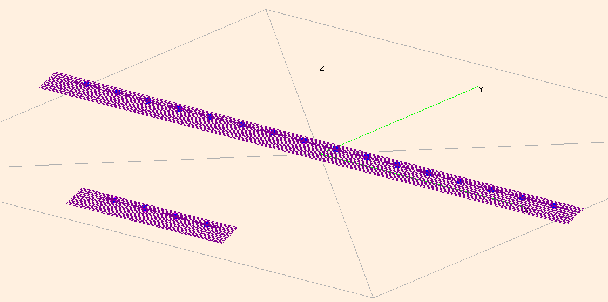

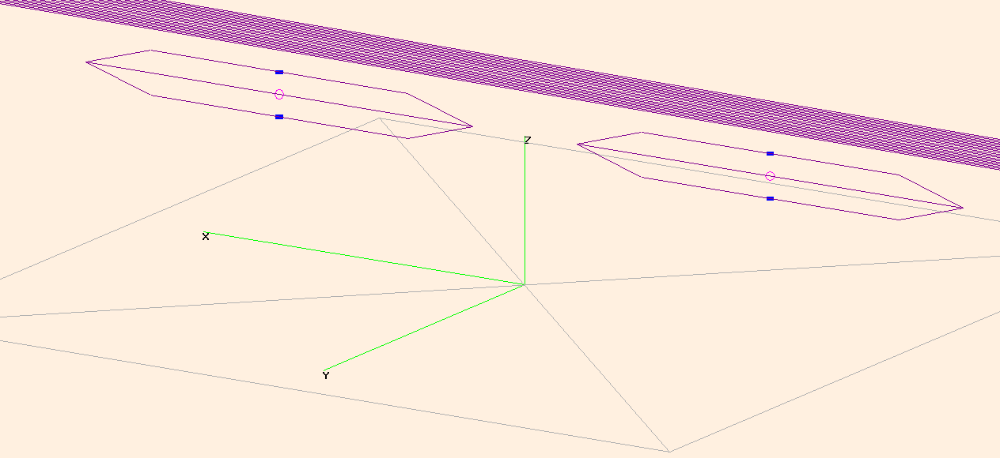

If you calculate this array geometry with the defaults, you'll see this window from 4nec2: This
shows the horizontal gain in red, and the vertical gain in blue. You'll notice that the most power
is in the main lobe at 0 degrees off azimuth (boresite). This is effectively a beam 7.5 in the
standard SuperDARN configuration and shows that the radar array has a F/B ratio of 22dB, a beamwidth
of 8 degrees and a gain of 17.47dB. Note this is at a frequency of 10.5MHz.

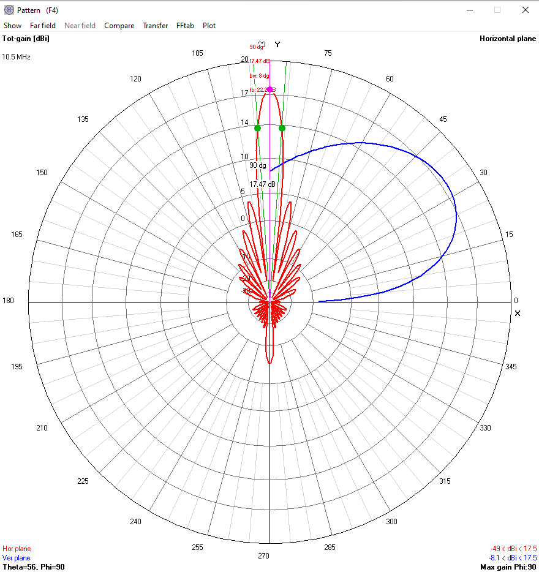

So, why is this considered a tool? What happens when a transmitter goes down? What happens when two
transmitters go down? What about if the power output from one transmitter is half of what it should
be? How about phase errors? All of these questions are possible to answer with tools like this one.
Here's a real example from Rankin Inlet, where transmitters #6 and #12 (indexed from 0) are both
down:

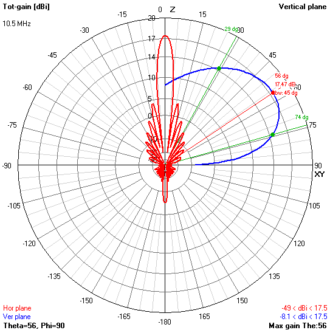
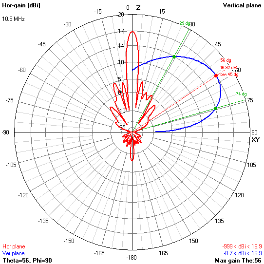

The above two images are generated for the radar at Rankin Inlet, the first image shows the standard
pattern if everything is working properly at boresite. The second image shows the pattern resulting
from transmitters #6 and #12 not contributing to the system. The effects are immediately visible in
the higher power sidelobes. The main lobe gain is reduced from 17.47dB to 16.92dB. The main lobe
remains the same shape and width in both azimuth and elevation angles.

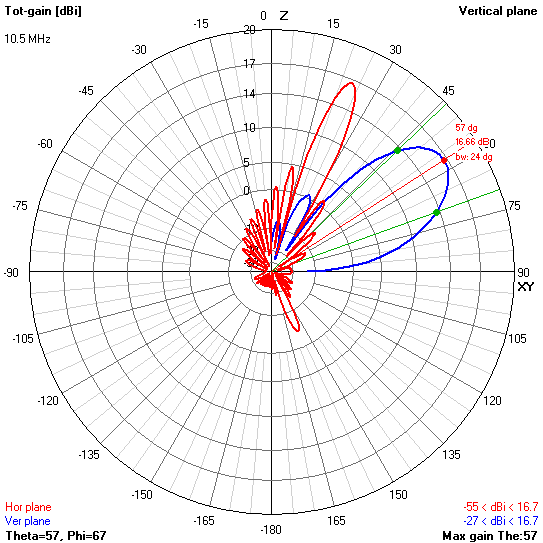
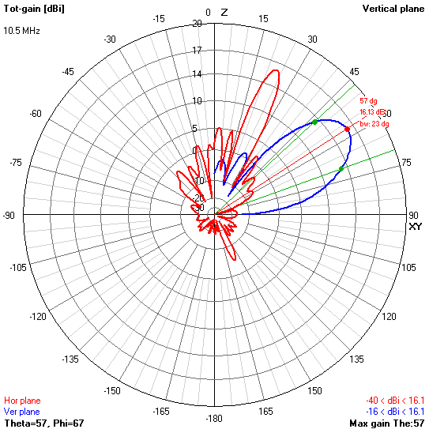

The above two images are generated for the radar at Rankin Inlet, the first image shows the standard
pattern if everything is working properly at beam 1. The second image shows the pattern resulting
from transmitters #6 and #12 not contributing to the system. The effects are immediately visible in
the higher power sidelobes. The main lobe gain is reduced from 16.66dB to 16.13dB. The main lobe
remains the same shape but is slightly smaller (~1 degree) in elevation angle.

.. _NTP:

---
NTP
---

A python script called ``plot_ntp_stats.py`` located in the ``tests/NTP`` borealis directory contains
functionality that can be used to plot some common statistics that the ``ntpd`` program can produce.

It requires that you've set up ``ntpd`` to log statistics. Currently supported plots are basic, but
still useful. This script also requires the ntp configuration file to be able to accurately
calculate the Allan deviation for PPS drivers.

The Allan deviation can be plotted if you have a ``clockstats`` file. The subject of Allan deviation
is beyond the scope of this documentation, but it can give you an indication of your short, mid and
long-term stability of your oscillator. In short, if you see a negative relationship between the y
axis and the x axis that means that over the long term your oscillator is more stable than it is
over the short term. Phase noise and Allan deviation are closely related.

Here is an example of an Allan deviation plot:

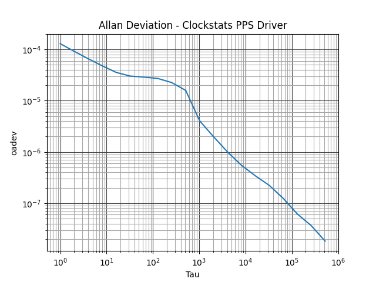

Looking at the above image, it's clear that the clock stats indicate the clock is more stable the
longer you view it. This is generally true for GPS disciplined clocks. If you have a piezo crystal
oscillator and generated an Allan deviation plot for it, you might see the opposite relationship.
Combining the two types of clocks into a GPS disciplined oscillator will get you the best of both
short and long term stability.

If you have a ``loopstats`` input file then you can plot two quantities:

 - The ``ntpd`` estimated time offset from true time in seconds vs time smaller values are better.
 - The ``ntpd`` estimated frequency offset in PPM from a 'true oscillator' (ideal UTC clock) vs time,
   smaller values are better.

Here are example plots of the ``loopstats`` offset and frequency offset:

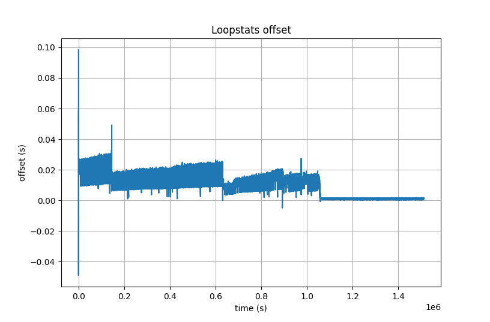

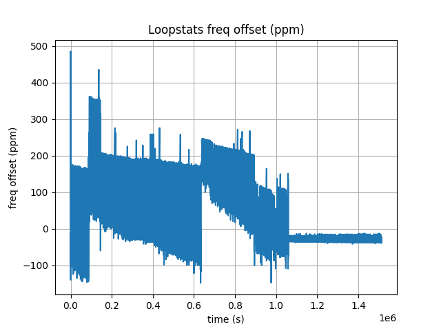

If you have a peerstats input file then you can plot three quantities for each peer:

 - The ``ntpd`` estimated time offset from true time in seconds vs time, smaller values mean ``ntpd``
   thinks it's closer to true time.
 - The estimated round-trip time for ``ntpd`` packets vs time. Very small values would indicate the
   peer is on the local network.
 - The dispersion value (seconds) indicates how spread out the offsets are for this particular peer.

Here are examples of the above three plots:

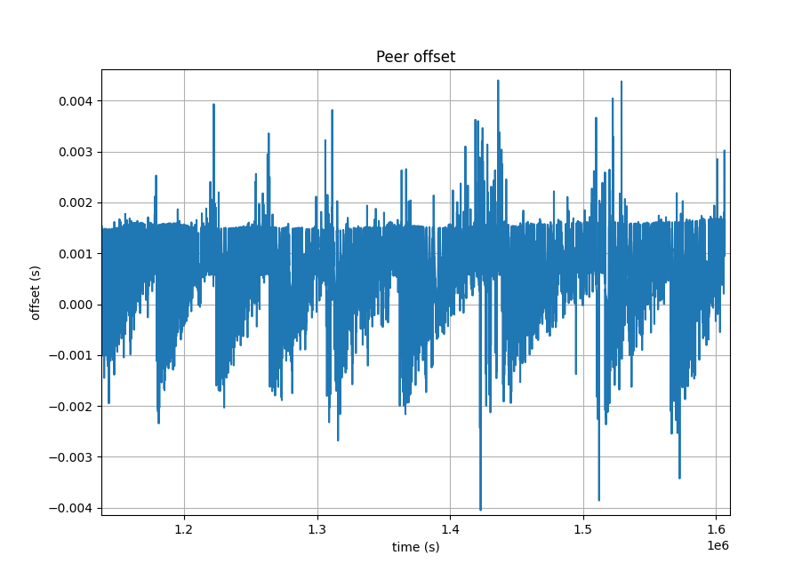

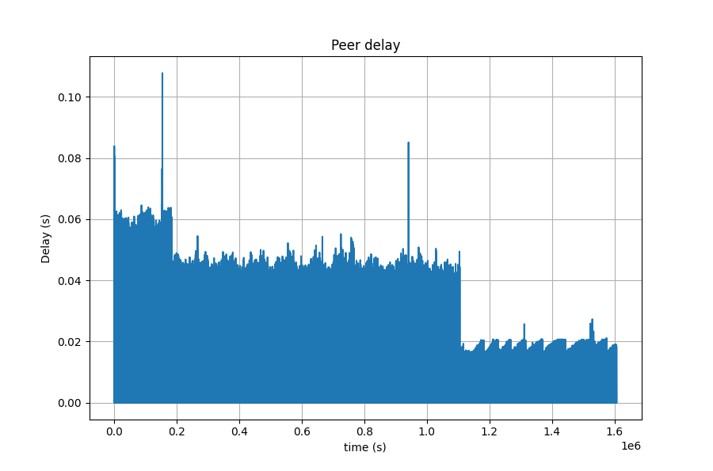

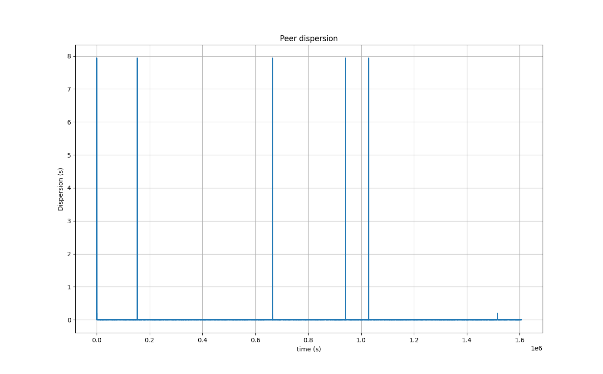

That dispersion plot looks like there are a few outliers, so lets zoom in on a smaller section:

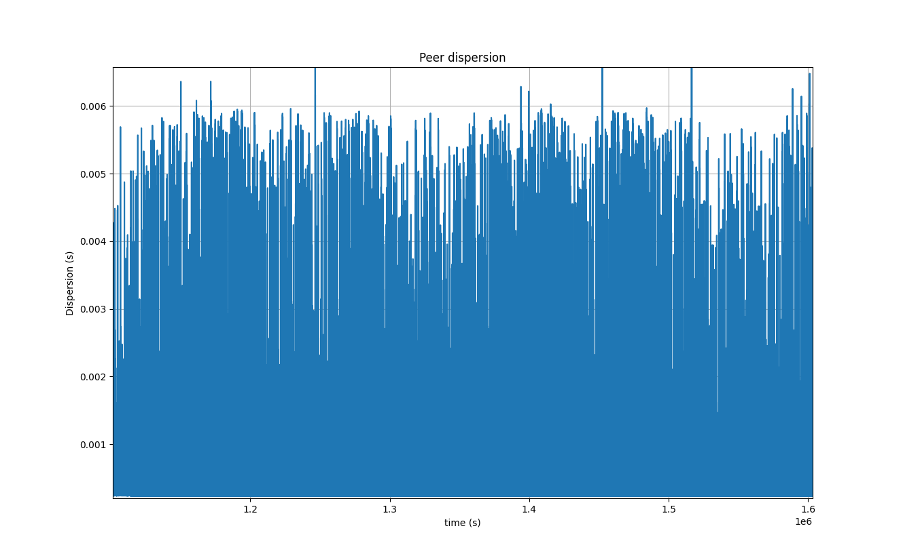
