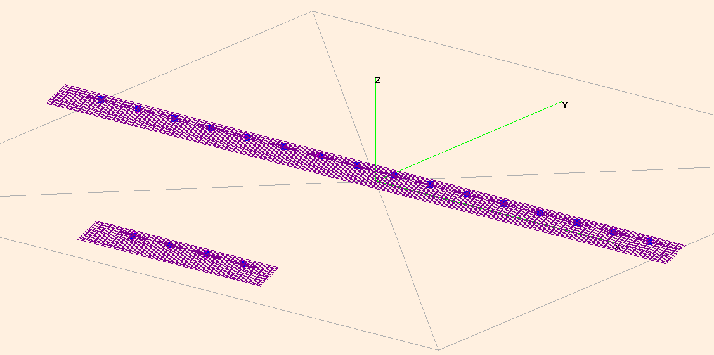
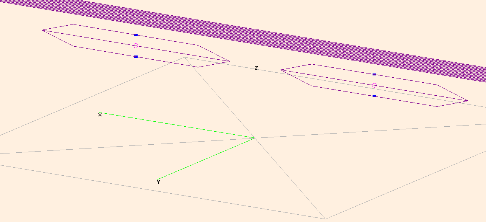
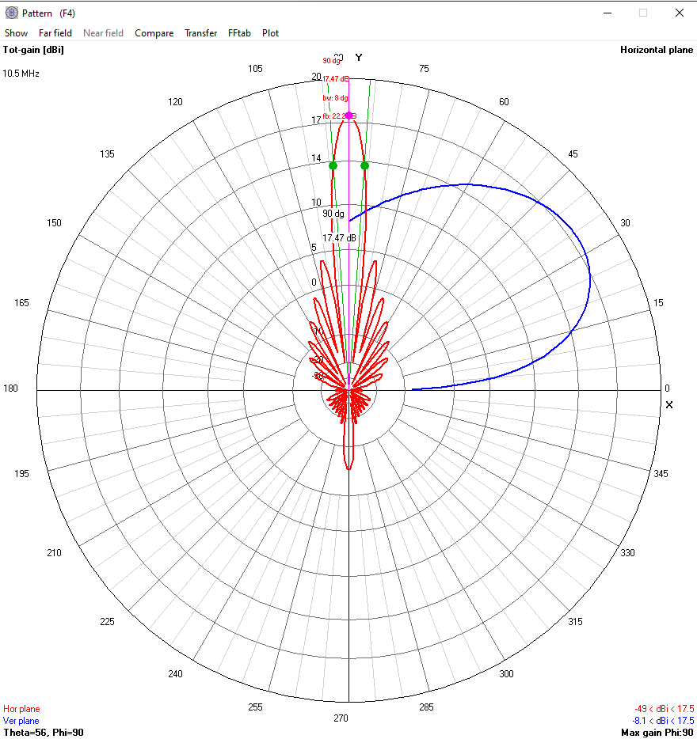

=====
Tools
=====

---
NEC
---

A python script called `nec_sd_generator.py` in the tools/NEC Borealis directory contains
functionality to produce the correct geometry and other inputs for a NEC engine program like
4nec2 to simulate/model SuperDARN antenna arrays.

This script can be used to generate some common orientations of the SuperDARN antenna arrays
for use with a NEC engine. Some programs that can read NEC inputs are 4nec2 or eznec. This
script has been tested with the free, latest version of 4nec2, 5.8.17, updated January 2020 and
available here: `https://www.qsl.net/4nec2/`_

In order to use this with 4nec2, simply open 4nec2 and go to `File->Open 4nec2 in/out file` and
select the file (it must end in '.nec'). Then hit `F7` or go to the `Calculate->NEC Output-data`
option. Interpretations of the results are beyond the scope of this help message. Note that
4nec2 requires DOS line-endings, which is why this script outputs DOS line endings.

By default, if you run this script with no options, it will create TTFD main and interferometer
arrays with 21-wire reflectors, oriented like the Rankin Inlet radar with the main array in
front of the interferometer array. This can be changed with the `--int-x-spacing`, `--int-y-spacing`
and `--int-z-spacing` options which take in a floating point number of meters to offset the
interferometer from the main array in 3d space. By default, it is 100m behind (y == -100)
and centered in both x and z dimensions. Turn off the reflector via the `--without-fence` flag.
In summary, the boresite is in the +y direction, the arrays are typically along the x axis,
and the +z axis is distance from the ground.

The number of antennas in both the main and interferometer arrays are controlled via the
`--antennas` and `--int_antennas` options. Defaults are 16 and 4, like the Rankin Inlet array. Set
the `--int_antennas` value to 0 to remove the interferometer array.

The antenna spacing can be modified from the 15.24m default via the `--antenna_spacing` option.

The beam and frequency used can be changed from the defaults of boresite and 10.5MHz via the
`--beam` and `--frequency` options, which take floating point values.

Finally, you can provide a custom name for the file generated by this script using the
`--output_file` option. Just be aware that 4nec2 input file naming requirements are strict, no
periods, and it must end in '.nec'.

**NOTE** There are some options that are not supported yet, like log periodic arrays, yagi
arrays, as well as different power and phase inputs for the arrays. As well, baluns and
feedlines are not implemented, so the signal sources are currently modeled directly where
the balun would be on the antennas.

Here are two images that show what the default geometry looks like when importing the default
output file into 4nec2. In the first image you can see a wide bird's eye view of the main and
interferometer arrays. In the second image you can see a close-up of the main array center two
antennas, with the 21 reflector wires in the background. The blue rectangles are the loads and the
pink circle on the antenna's is the current source modeled in NEC.

If you calculate this array geometry with the defaults, you'll see this window from 4nec2:
This shows the horizontal gain in red, and the vertical gain in blue. You'll notice that the most
power is in the main lobe at 0 degrees off azimuth (boresite). This is effectively a beam 7.5
in the standard SuperDARN configuration and shows that the radar array has a F/B ratio of 22dB, a
beamwidth of 8 degrees and a gain of 17.47dB. Note this is at a frequency of 10.5MHz.

