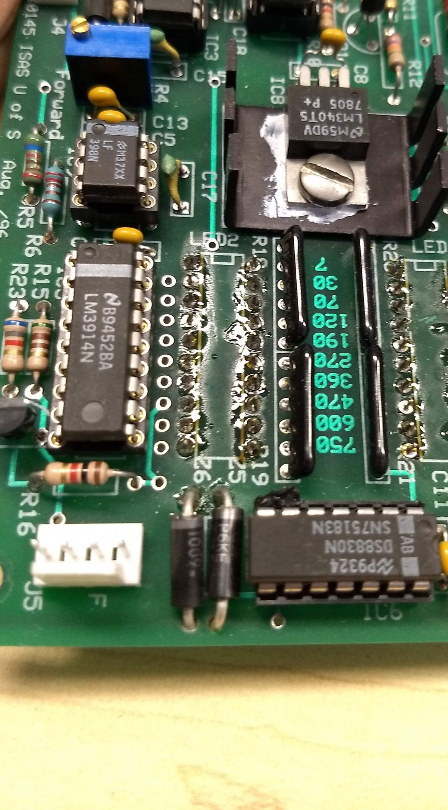
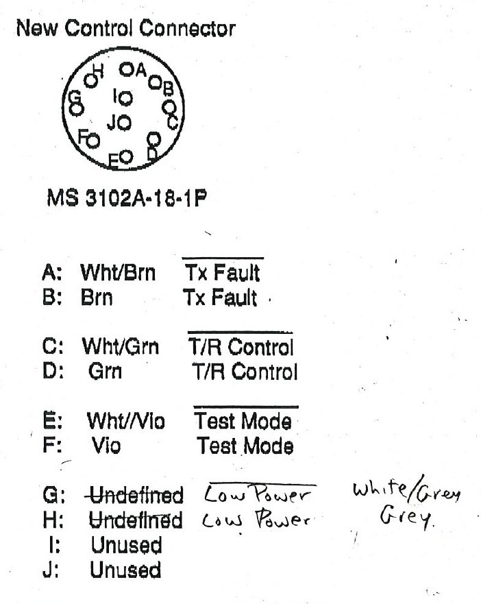
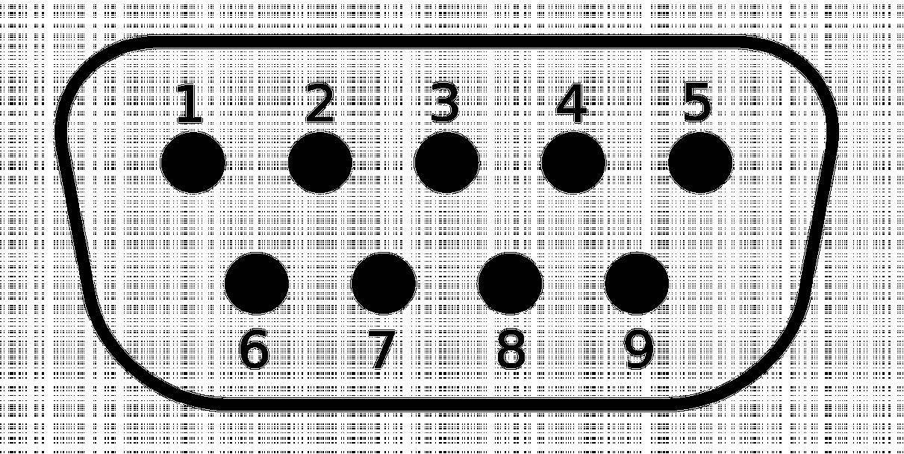
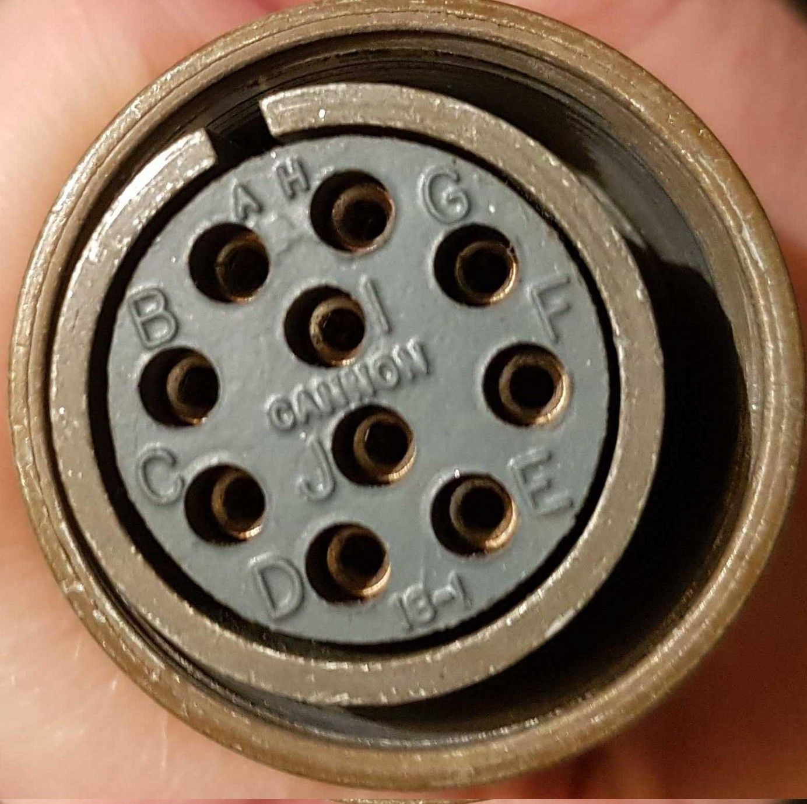
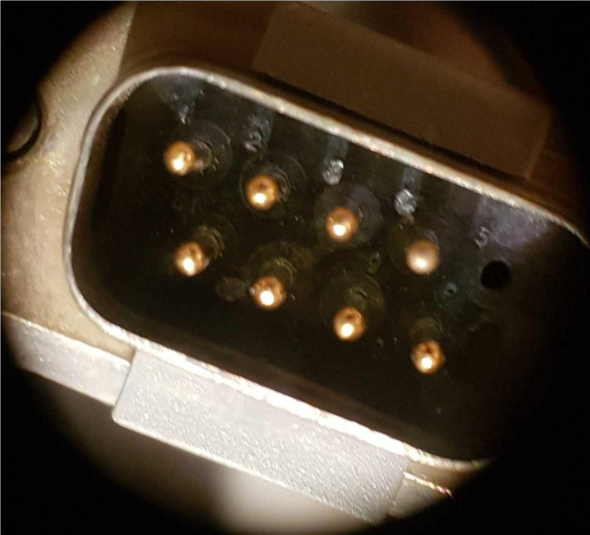
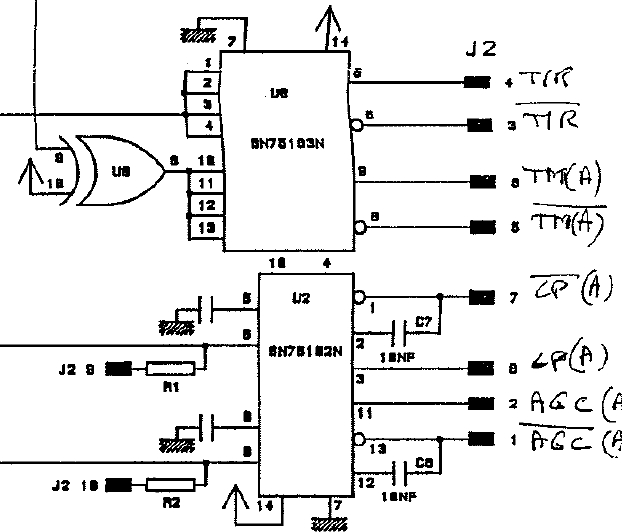

.. _transmitter-interface:

=======================
Transmitter interfacing
=======================

The Borealis system doesn't include a change of transmitters. Therefore, it is important to
understand how to properly interface with the existing transmitters at each SuperDARN site.

There are various transmitter styles in existence. This page attempts to document the potential
interfaces of known transmitter styles.

-----------------------------------
SuperDARN Canada style transmitters
-----------------------------------
SuperDARN Canada maintains five different sites, which were built over the course of 20 years.
Even within these sites, there are certain differences between transmitters, but thankfully the
commonalities between the interfaces are similar enough to allow a single design to be used.

The design is called the ``TXIO`` board and it consists of a custom PCB that uses GPIO signals
from one of the two daughtercards in the N200s (either the LFRX or LFTX) that are programmed as
ATR (Automatic Transmit-Receive) and conditions those single-ended signals into differential signals
that the SuperDARN Canada transmitters expect. See :ref:`TXIO board design <txio-board>` for details
on the TXIO board. It also has two inputs from the transmitters for the
:ref:`Low Power <low-power>` and :ref:`AGC Status <agc-status>` signals.

.. _agc-status:

AGC status signal
-----------------
The AGC status signal is a differential output from the AGC boards. It indicates when there is a
problem with the transmitter, or if it is in test mode. If this signal is active, that means that
the transmitter is not transmitting. It is generated by ANDing the following four signals on the
AGC board with a SN75183 (U203 on new AGC boards):

- 500V_OK – This signal indicates that the 500V line that back-biases the HPTR switch PIN diodes
  during transmission is of a sufficient voltage
- SWR_OK – This signal indicates that the reverse power is not too high (that the SWR is low
  enough to not cause damage to the transmitter)
- TR_OK – This signal indicates that there has been a TR pulse within the last ~150ms. It is
  generated with an SN74LS123 monostable multivibrator and a Rext of 22kOhm/Cext of 22uF.
- TEST – This signal indicates if the AGC is in test mode or not. It is a differential input to the
  AGC boards that is received by a differential line receiver, the SN75182 (U200 on the new AGC boards).

.. _low-power:

Low power signal
----------------
The low power signal is a differential output from the AGC boards. It indicates when the output
power from the transmitter is below a certain threshold. It is generated by the Power Monitor board
IC6, which is a dual differential line driver chip, the SN75183. This signal is output from the
Power Monitor board via the 4 pin connector J5. See photo below of the Power Monitor board,
showing IC6 and J5 at the bottom middle and bottom left:

Grey TX Interface cable
-----------------------
The grey transmitter interface cable, with a military screw-style connector on the transmitter end,
and a DE9 style connector on the old control card end carries 4 differential signals:

- T/R – Transmitter input
- Test mode – Transmitter input
- Low power – Transmitter output
- AGC status – Transmitter output

The pinouts for both ends of this cable are shown below:

.. list-table:: Interface Cable Pinout
   :widths: 25 25 50
   :header-rows: 1

   * - DE9 pin number
     - Mil-style connector pin
     - Signal Description
   * - 1
     - A
     - AGC_STATUS Minus [AKA TX_FAULT Minus]
   * - 2
     - C
     - TR Minus
   * - 3
     - E
     - TEST_MODE Minus
   * - 4
     - G
     - TEST_MODE Minus
   * - 5
     - [Male Pin Not Populated]
     - [No signal]
   * - 6
     - B
     - AGC_STATUS Plus [AKA TX_FAULT Plus]
   * - 7
     - D
     - TR Plus
   * - 8
     - F
     - TEST_MODE Plus
   * - 9
     - H
     - LOW_POWER Plus

**NOTE that TEST_MODE- may be swapped with TEST_MODE+ in some Transmitters**

Photos of both ends of the cable are shown below:

Legacy Control Card
-------------------
At the Canadian SuperDARN radar sites (except Clyde River) the grey TX control cable referenced
above is connected to a control card that has internal circuitry to receive the Low Power and AGC
status differential signals, and circuitry to generate the TR and Test Mode differential signals.
The SN75183N chip (U8 in the figure below) is a dual differential line driver and drives the TR and
Test Mode signals. The SN75182N chip (U2 in the figure below) is a dual differential line receiver
and receives the Low Power and AGC Status differential signals, converting them to single ended TTL
signals. J2 is an internal connector on the Control Card and does not reflect the pinout of the DSUB
connector on the grey TX control cable. An excerpt from the schematic is shown below:

Clyde River Transmitters
------------------------
The Clyde River radar transmitters are the latest to have been built (~2011) and have a slight
difference in the interface. A modification was required to break out the LOW_PWR,
AGC_STATUS, TR and TEST_MODE signals to the front panel, after which the TXIO board designed for the
rest of the SuperDARN Canada radars worked as designed.

----------------------------
Leicester style transmitters
----------------------------
[TODO]

----------------------
MSI style transmitters
----------------------
These transmitters do not have an AGC board as the SuperDARN Canada style transmitters do,
and thus the signals are different.

[TODO]
