.. _txio-board:

=================
TXIO Board Design
=================
From the information about the existing SuperDARN Canada transmitters, an interface board was
designed to be installed inside the Ettus N200s. The latest version of this board is version 5,
designed in 2019.

First, some information regarding the N200 internal circuitry was required,
then information about the existing transmitter control cables and interface was required,
finally, this information was used to design the appropriate circuits.

--------------
N200 Circuitry
--------------

Within the Ettus N200, there are several places to get 6V power from. The motherboard has several
sources of power, including fan power, optional GPS unit power, and AUX power. As well, the
daughterboard interface has 6V power routed through it.

Motherboard
-----------
From the open source schematics at https://files.ettus.com/schematics/ for the N200, there are
several images below showing the power routing available on the motherboard:

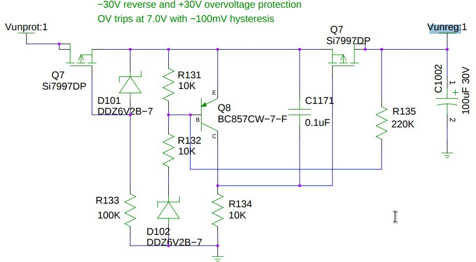

First, the unprotected front panel power input is protected with the above circuitry, and the
resulting net (supply) is called Vunreg for unregulated voltage supply.

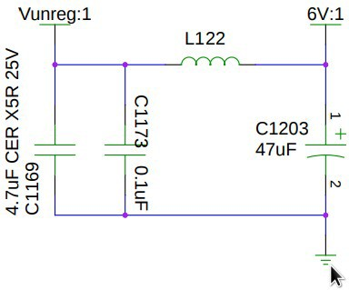

Next, this unregulated supply is isolated from other circuitry by way of an L-C circuit shown above.
It is still unregulated at this point, but the resulting net is called 6V due to the input power to
the N200 being a 6V wall supply.

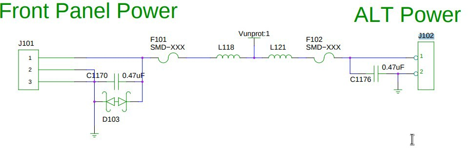

There is also a connector known as “ALT Power” at the back of the motherboard, which is protected
via fuse F102. This is also the circuitry that creates the Vunprot net, which is simply the power
input to the N200, protected by a fuse F101, a zener diode package D103 and a capacitor C1170.
The fuse is 3A, indicated by a silkscreen on the motherboard near connector J102. There is also
silkscreen that states “AUX Power 6.3V ONLY 500mA”. Therefore, the fuse choice for the TXIO board
was set to 500mA to protect the TXIO board, and be well within the 3A limit of fuse F102.

LFRX Daughterboard
------------------

The 6V net is routed through both of the daughterboard interfaces, but first it goes through a
similar L- C circuit as above for the Vunreg to 6V nets. See the excerpt from the N200 schematics
below:

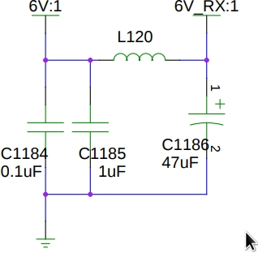

.. _gpio-logic:

GPIO Logic Levels
-----------------
The GPIO pins that are routed through the daughterboards on the Ettus N200 are not protected in any
way, they are a direct connection from the Xilinx FPGA pins, which have LVCMOS signaling. From the
datasheet, the absolute maximum voltage on any pin is 4.6V:

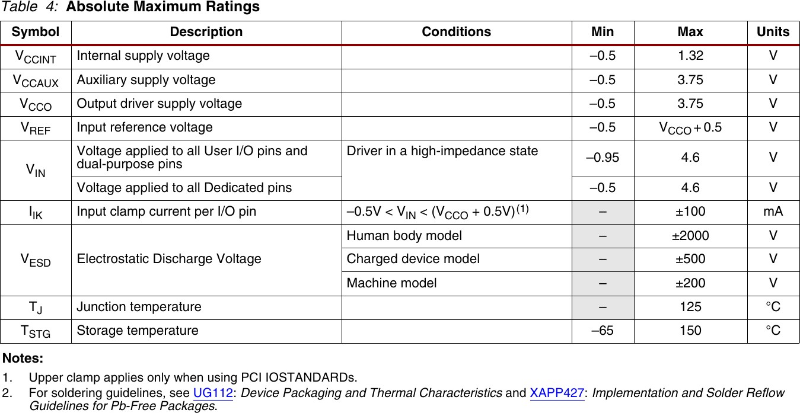

-----------
TXIO design
-----------
This section describes some of the design of the TXIO board, latest revision.
Please see the pdf of the schematic here: :download:`TXIO schematic <download/txio_rev5_schematic.pdf>`
See also a representative BOM here: :download:`TXIO BOM revision 5 <download/txio_rev5_bom.pdf>`

Change Notes for Revision 5
---------------------------
- Change pad sizes for capacitors to 0805 from 0805 hand-solderable. This was done because the pads
  of the capacitors were too large, and accommodated even 1206 sized capacitors.
- Change pad sizes for resistors to 0603 hand solderable from 0805 hand solderable. This was done
  because the placement of the 0603 resistors on the pads was impossible to reflow.
- Change pad size for fuse from smd1206 hand solderable to smd1206 reflow. This was done because the
  fuse pads were unnecessarily large.
- Increased size of pads for soic narrow packages and moved pads closer to the centre of the chip.
  This was done because when reflowing the soic packages, the pads were slightly too wide, making
  placement of the packages difficult and resulting in one failed reflow.
- Moved all vias out from underneath silkscreen text or symbols. Done for readability of the
  silkscreen text.
- Changed silkscreen values for all resistors to indicate what the resistor was for.
- Changed silkscreen values for C2 and C5 from 0.1uF to 0.1u to be consistent with the rest of the
  silkscreen values for capacitors.
- Added two LFRX GPIO signals to the LFRX header, routed through the two remaining inputs on the
  buffer/driver chip U5 to be used as general purpose outputs, which are routed to the LED header,
  with 5V pull-up resistors R5 and R6.
- Added circles on the top solder paste layer where the header pins are located (J1, J2 and J3) in
  order to have holes in the stencil to apply solder paste to the through-hole headers.
  See “Paste-in-hole” reflow techniques for more information. This will reduce the number of steps
  required to assemble these printed-circuit-boards.

Renders
-------

The PCB renders are shown here for the latest version, revision 5.

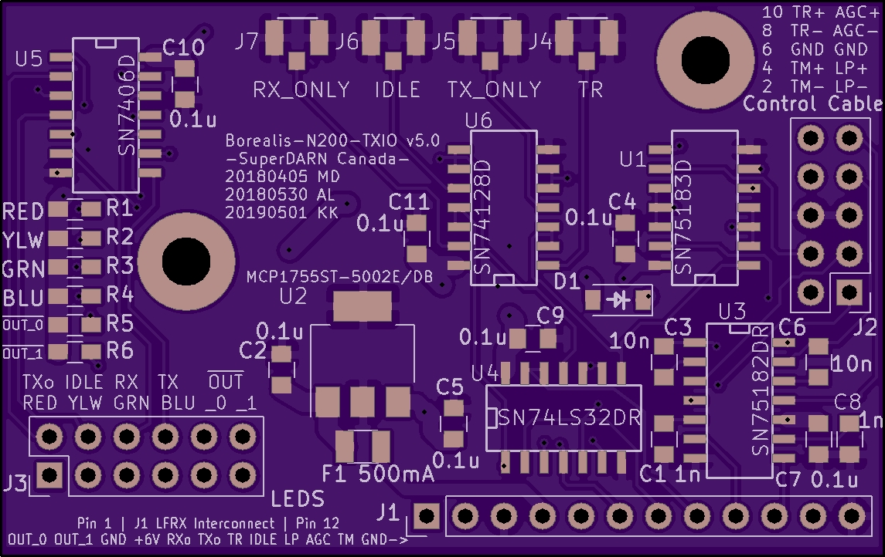

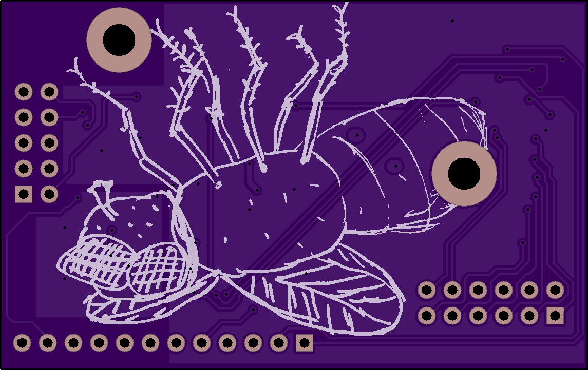

Dual Differential Line Receiver - SN75182N
------------------------------------------

Capacitor Selection:

There are two capacitors to select values for in the design of the differential line receiver,
a response time control capacitor (RTC, C1 and C8 on the Rev4 schematic) and a DC block capacitor
(C3 and C6 on the Rev4 schematic).
The RTC capacitor is used to prevent noise spikes on the input from changing the output. It can
be selected by looking at the datasheet typical characteristics chart, shown below:

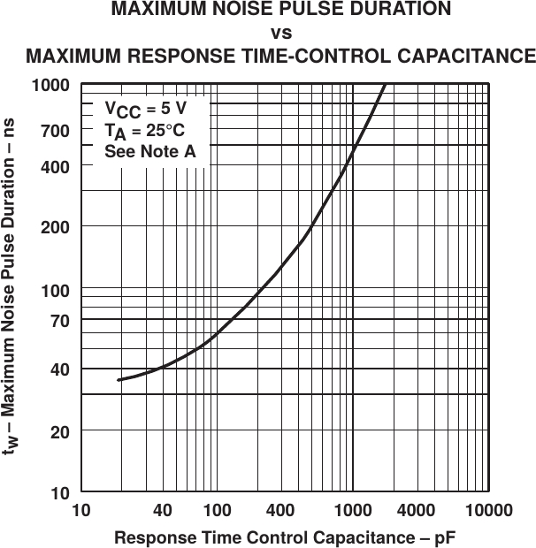

As can be seen in the chart, a 1nF capacitor will allow a maximum noise pulse of ~500ns duration.
In the old control card design, this capacitor is 10nF, which is on the far right of the x-axis.
Extrapolating the plot would put the maximum noise pulse duration at approximately 10uS, so this is
the capacitance that will be selected as maximum allowed. If problems arise in the design, or if the
minimum TR length changes to below 10uS, this capacitor can be revisited.

The DC block capacitor is selected based on the typical frequency of operation of the part. The
fastest TR signal is currently 100uS in duration, so a frequency of 10kHz was chosen to calculate
capacitance values for C3 and C6. From the datasheet, the impedance of the capacitor should be
relatively low at the frequency of interest (say 10Ohms). From the Impedance calculation, this
results in a capacitor value of approximately 1.6uF maximum. A value between 1nF and 1uF can be used
for C1 and C8.

LED Driver - U5
---------------
Chip U5 on the schematic is an SN7406D LED driver. There are two extra outputs that can be utilized
and they are broken out into the LED header interconnect (J3). See the image below showing outputs
from drivers 5 and 6 "OUT_0" "OUT_1" that are available on J3.

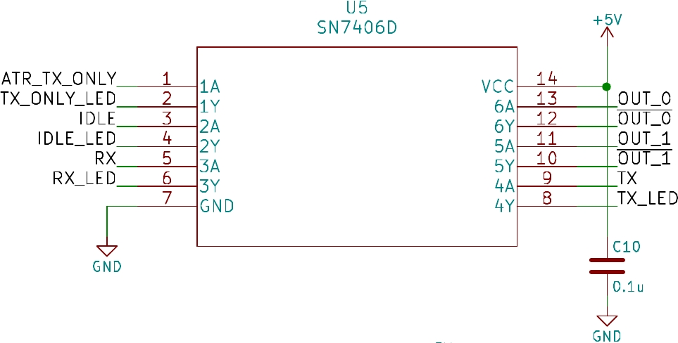

Pin Header Interconnects
------------------------

**LFRX Interconnect**
The LFRX interconnect is a 1x12 pin 0.1” standard header. It is J1 on the TXIO board,
located in the bottom right corner. Pin 1 is on the left, indicated by the square copper pad, the
rest of which are circular. NOTE: The top of the board is indicated by the 4 U.FL connectors, and
is the orientation that the silkscreen text is readable in. The pinout is shown below:

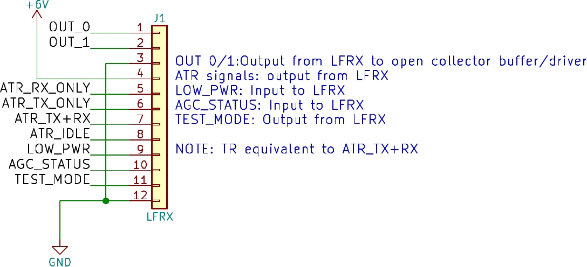

**Control Cable Interconnect**
The control cable interconnect is a 2x5 pin 0.1” standard header. It is J2 on the TXIO board,
located in the top right corner. Pin 1 is on the bottom right, indicated by the square copper pad,
the rest of which are circular. NOTE: The top of the board is indicated by the 4 U.FL connectors,
and is the orientation that the silkscreen text is readable in. The pinout is shown below:

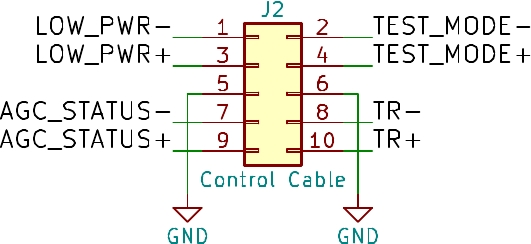

**LED Interconnect**
The control cable interconnect is a 2x6 pin 0.1” standard header. It is J3 on the TXIO board,
located in the bottom left corner. Pin 1 is on the bottom left, indicated by the square copper pad,
the rest of which are circular. NOTE: The top of the board is indicated by the 4 U.FL connectors,
and is the orientation that the silkscreen text is readable in.
The two extra outputs can drive extra LEDs or other low power +5V devices, and resistors R5 and R6
can be adjusted accordingly. The pinout is shown below:

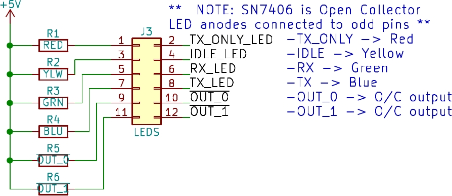

Input signal levels to daughterboard
------------------------------------

From the section above: :ref:`GPIO Logic Levels <gpio-logic>`, the max input voltage level to the LFRX is 4.6V.
The only signals routed as inputs from the TXIO board to the GPIO pins on the LFRX board will be the
AGC_STATUS and LOW_POWER signals, generated by the dual differential line receiver chip, SN75182.
The SN75182 datasheet specifies a maximum output voltage of 5.5V, but upon inspection of the
electrical diagram in the datasheet, this would only occur when no current is flowing out of the
output pin, and the VCC level was at 5.5V, and there is no voltage drop across a BJT output
transistor. A typical output voltage would be 4.2V with a VCC of 5.0V, 25C ambient temperature,
and 0V common mode input voltage.

In order to have more margin for error, a BAT46W diode is placed
in the VCC path for the SN75182 chip, in order to drop the supply voltage by ~300 to 400mV to 4.6V
or 4.7V, which is still within normal operating range. This will translate to the same voltage drop
on the output, to be typically 3.8V to 3.9V, so well within the FPGA's input voltage range.
See the BAT46W, SN75182 and Xilinx DS529 datasheets, as well as the N200 schematic for more
information.

Board Order
-----------
The file “Borealis-N200-txio.kicad_pcb” is uploaded to https://oshpark.com/, which then
automatically reads and checks for errors while breaking out all layers into rendered png files
for verification. The standard 2-layer service with default substrate material and thickness is
all that is required.

Stencil
-------
Once the boards are ordered from https://oshpark.com/, a stencil can be ordered from
https://www.oshstencils.com/, and the oshpark website will provide a link to this website and pass
the project files to it as well. The website software is smart enough to know that through holes
(for example, the mounting holes, and the 0.1” header holes) should not be included in the stencil.
However, the "F.paste" layer was modified in revision 5 to add circles over all through hole pins
so that the "Paste-in-hole" reflow technique can be used to reflow solder the through-hole headers.

The stencil is only required for the top layer, as all chips and components are on the top layer
of the board. A stainless steel 4mil (0.004”) stencil with a 1.25” border size was ordered for
~$22 CAD. It should last for many hundreds of boards. See the image below for a render of the
stencil:

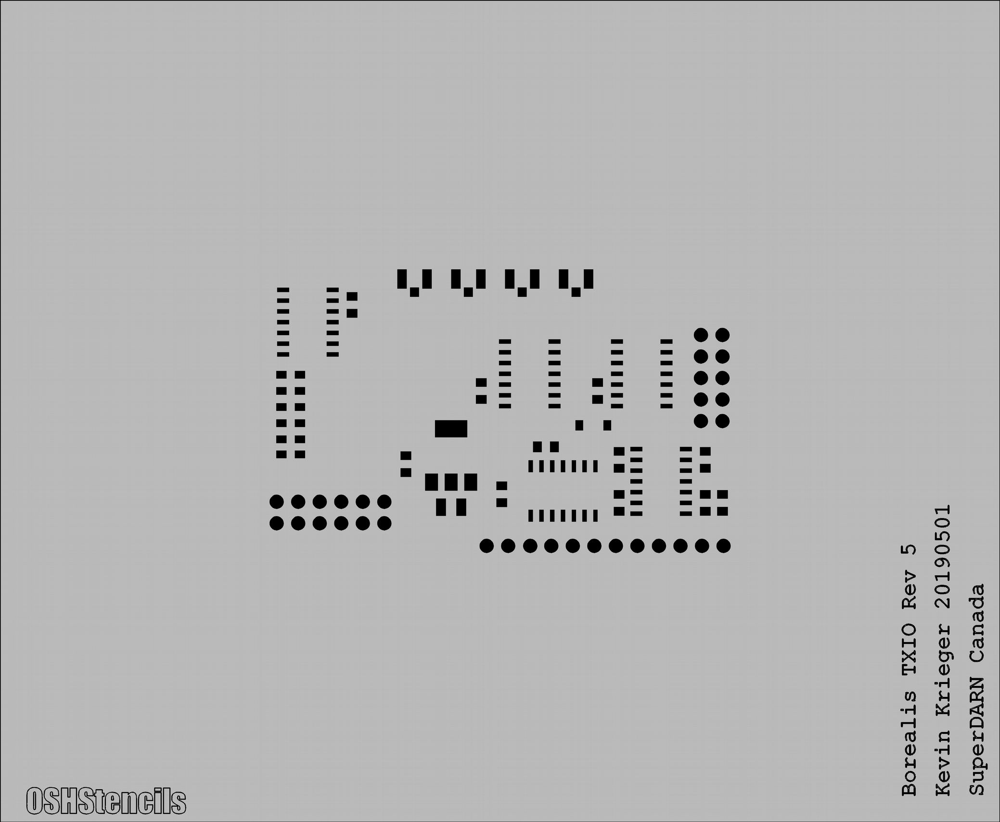

Notes on Part Selection
-----------------------
**Pin headers and Rear panel DSUB**

Pin headers were chosen based on availability, cost, positions, length, plating material, and
plastic material. The plastic material needs to be able to withstand at least the highest
temperature of a reflow oven profile for the type of solder used (typically ~255 degrees C)
without deforming. The plating material needs to be the same metal used for the type of connector
that will connect to it, to prevent any galvanic corrosion. Length of the pins needs to match the
connector used. Finally, the parts must be readily available and not too costly, as we are building
more than ten units.

**LEDs**

LEDs were chosen based on availability, cost, color, form factor, luminous intensity, and viewing
angle. The viewing angle needs to be wide enough to see the LED easily within a building housing the
Borealis rack (greater than 15 degree half-angles are suggested), the luminous intensity of all four
types of LEDs should be roughly the same, so that the luminous intensity can be controlled via the
current-limiting resistor. The intensity of the green and blue LEDs are decreased by increasing the
size of the current-limiting resistors so that they are a comfortable brightness in a well-lit room.
The form factors all need to be the same to fit the LED front panel clips,
and the LEDs should be widely available at a reasonable cost.

**Chips**

All chips were chosen based on availability, cost, form factor (SMD, hand-solderable for field
repairs and reflow-solderable for initial build) and supply voltage.

-------------------------------
Historical Designs
-------------------------------

Revisions 1 through 4 were developed by Marci Detwiller and Adam Lozinsky at the University of
Saskatchewan from the years 2017 to 2018.

USRP-TR-BRD (Delay line revision)
---------------------------------
Initially, a delay-line method was prototyped.
This design was completed in January 2017 by Marci Detwiller as a prototype with LTC6994 delay line
chips used in order to achieve the proper timing of the DDS system’s ATTEN and TR signals.
The design was changed the following year to utilize ATR signals from the ETTUS N200s instead of
timed GPIO commands. This rendered the delay-line type design obsolete.

See photos below of a populated and an unpopulated board both front and back:

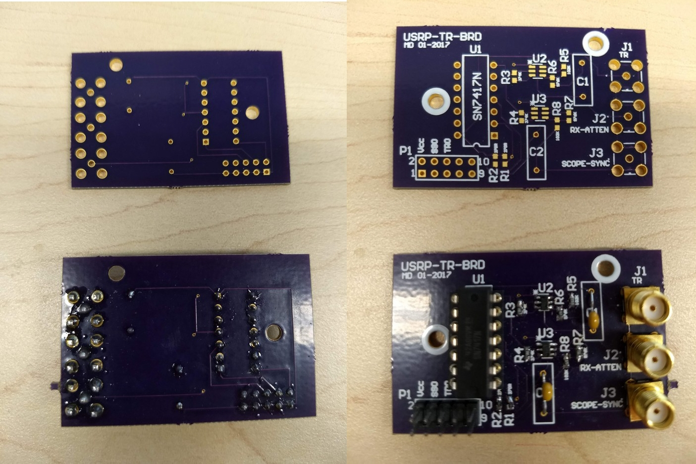

Revisions 1 and 2
-----------------
Designed April & May 2018 – Marci Detwiller.
** NOTE ** The silkscreen on this design states “v1.0” but it is actually Rev1 and Rev2. The “v1.0”
refers to the first version of this type of design without the delay lines.

- P1 Is an input header 0.1 inch 1x6. It takes ATR generated signals (as well as +6V power and ground)
  from the LFRX daughterboard inside the ETTUS N200. The TXIO board utilizes the ATR generated signals
  to generate TR/TX/RX/Txonly/Rxonly/Scope Sync/Idle signals to drive indicator LEDs on the front of
  the N200, as well as the drive a TR signal for input to SuperDARN transmitters.
- P2 is a 1x8 output header that exposes the signals:
    • TX
    • RX
    • Ssync
    • Idle
    • T+R
    • Rxo
    • Txo
    • GND
- P3 is a 1x4 output header that supplies a TX_only signal to the display LEDs
- P4 is a 1x4 output header that supplies an RX_only signal and a TX+RX signal to the display LEDs
- P5 is a 1x4 output header that supplies an S-SYNC signal and an IDLE signal to the display LEDs
- P6 is a 1x4 output header that supplies a TX signal and an RX signal to the display LEDs
- J1 through J4 are U.FL coaxial cable connectors that expose S-SYNC, T+R, RX, and TX signals
  respectively to SMA bulkhead connectors on the ETTUS N200 box.

See renderings below of an unpopulated board:

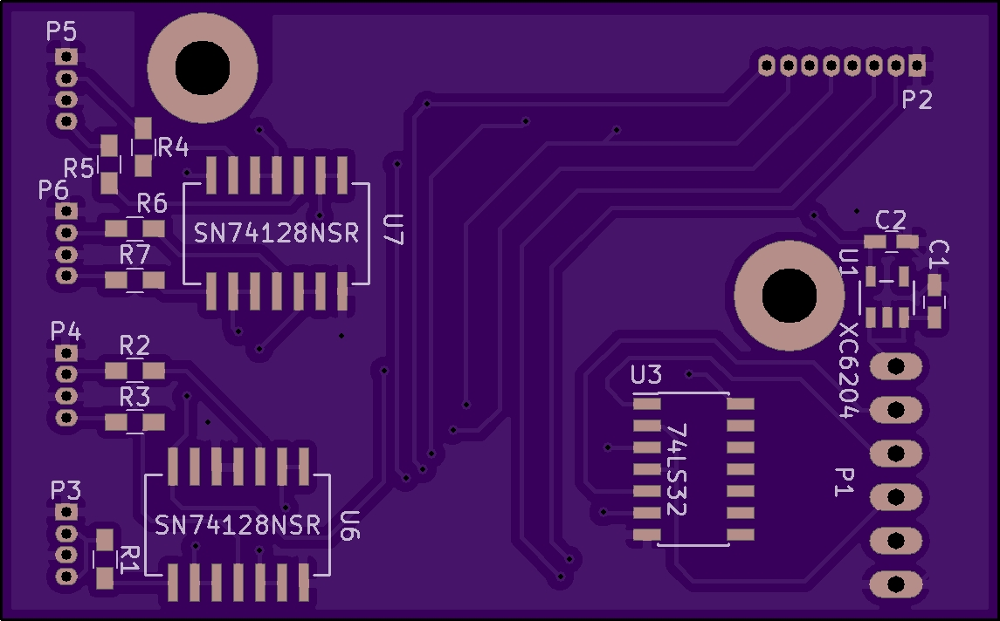

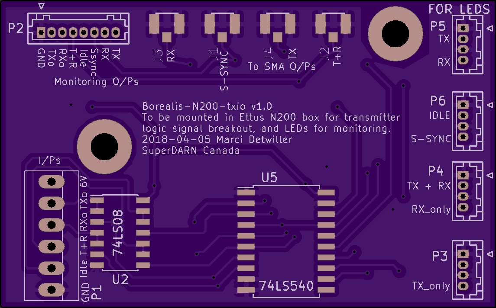

Revision 3
----------
This revision of the TXIO board design was completed by SuperDARN Canada summer student Adam
Lozinsky in May 2018. The design was simplified/modified based on testing of Rev 2.

**Change notes**

- Positions of components moved
- All of U1-U7 now indicate pin 1
- LED current limiting resistors changed to reduce brightness
- LED pattern changed
- P3 through P5 simplified and reduced to one 0.1inch header
- P3 P2 changed to 2x4 0.1 inch header

See rendering below of an unpopulated board, and photos of a populated board installed in an ETTUS
N200, the front panel LEDS, the back panel SMAs, the back panel DSUB, and photos of the LFRX power
and ATR connections:

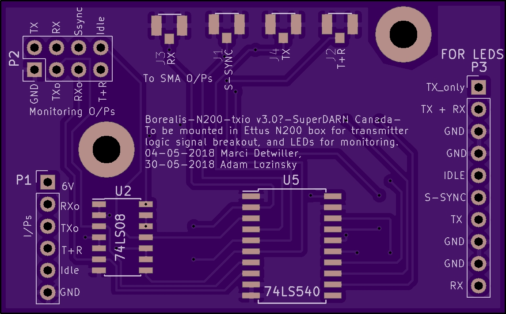

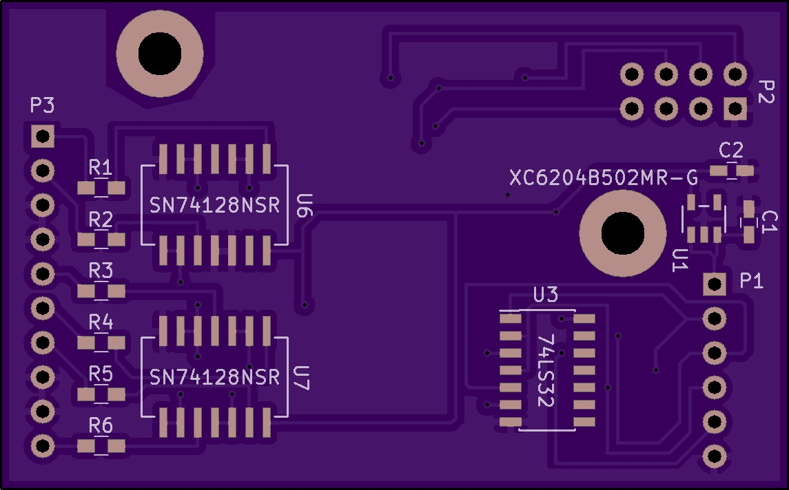

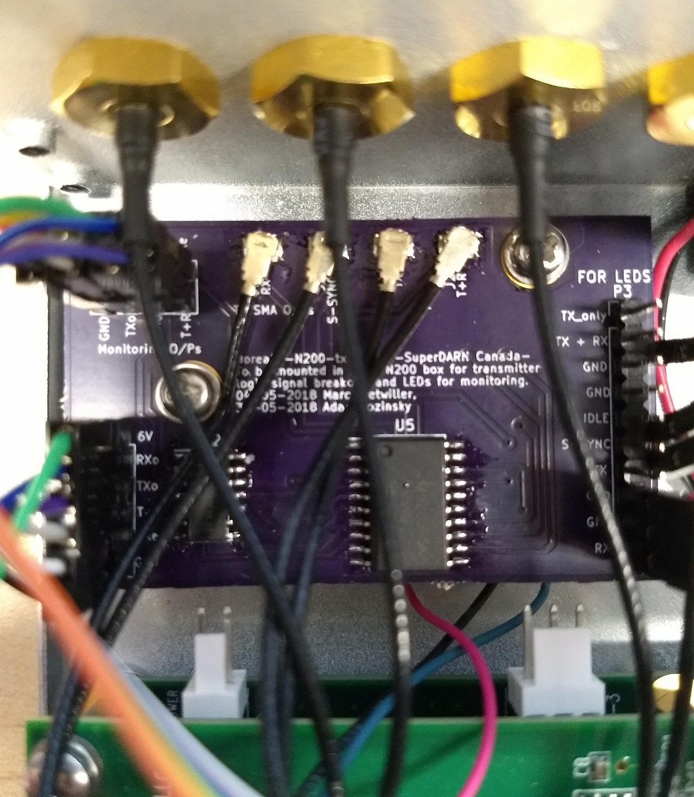

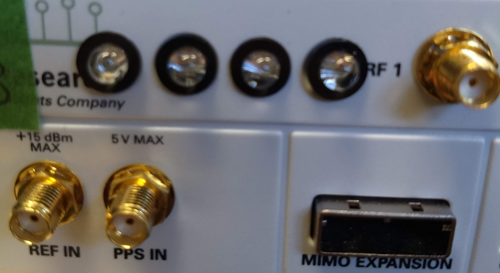

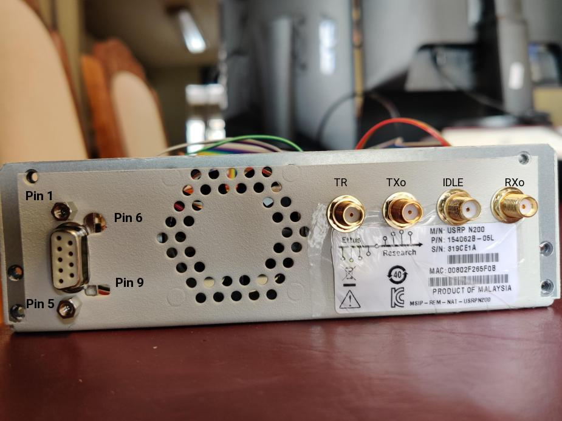

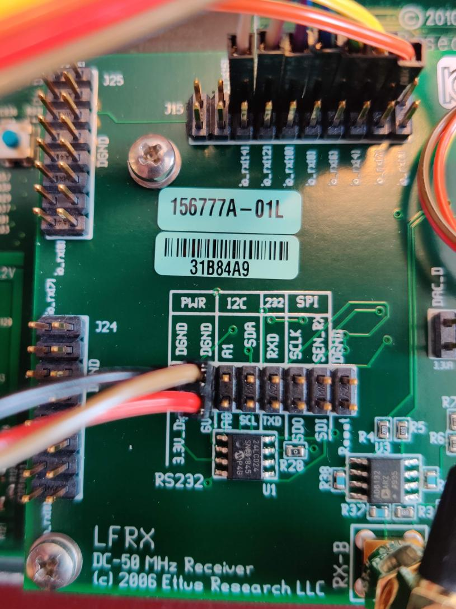

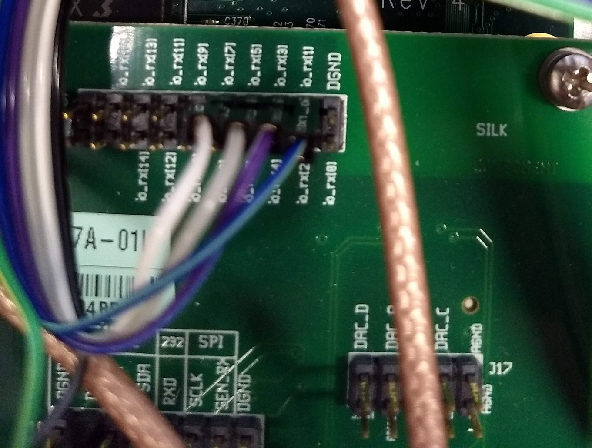

Revision 4
----------

This revision was made by Kevin Krieger in April 2019 based on issues interfacing the single-ended
TR signal to the existing transmitter setup, which requires a differential signal. It was also
designed to be soldered in a reflow oven which was purchased by ISAS.

The LED patterns are shown below in an excerpt from Adam Lozinsky’s notes for the rev 4 version.

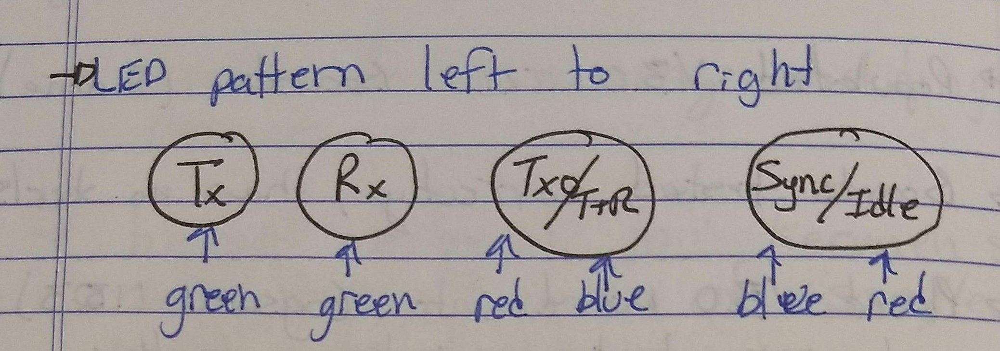

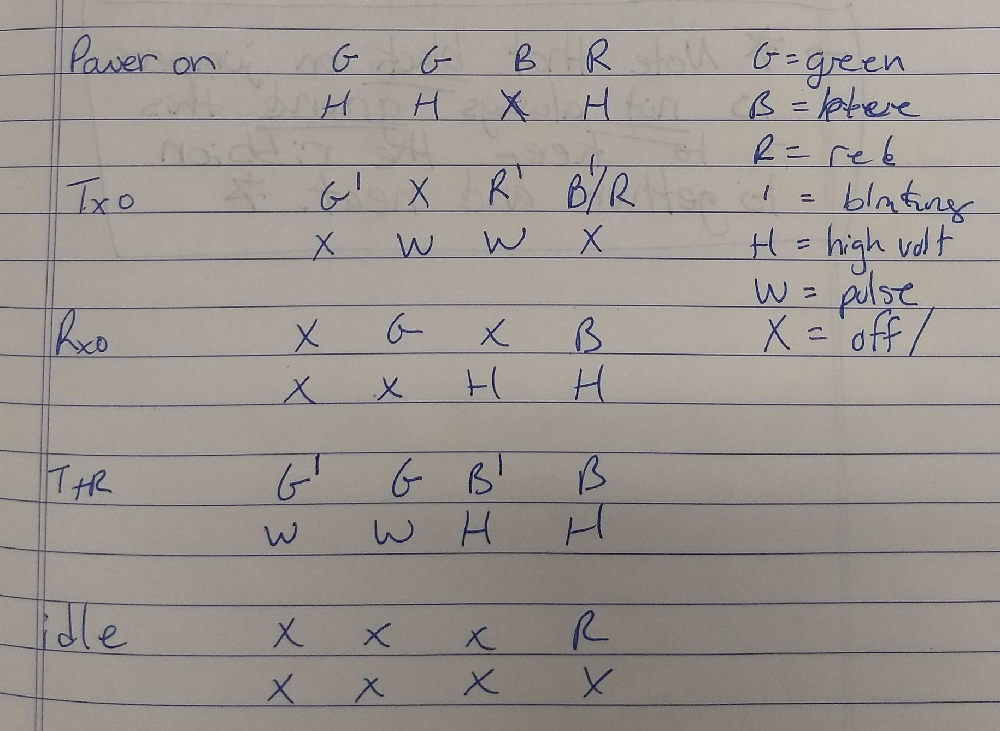

**Change notes**

- Simplify LED signaling.
- Implement TX signals interfacing utilize existing DE9 connector to get AGC status and low power
  status from the transmitters, and to provide TR and TEST MODE signals to the transmitters with
  the proper differential signals, using dual differential line driver SN75183, and dual
  differential line receiver SN75182.
- Reorder numbering of Jacks (J1 through J4, now J4 through J7) to follow physical layout.
- Upgrade the voltage regulator to one that can handle 300mA of current to properly supply all chips.
- Add footprint for 1206 sized surface mount fuse.
- Change driver chip for SMA outputs to a 50Ohm line driver, SN74128.
- Change LED driver to SN7406, hex inverter, open collector outputs, 40mA sink current capability.

**LED Signaling**

The front panel LEDs have been simplified after experience with the old rev3 design. They are now:

- TX – Blue – This should be on during transmit, so to the human eye, it should always be on.
- RX – Green – This should be on during receive, so always on.
- IDLE – Yellow – This should be on only between pulse sequences.
- Txonly – RED – This should not come on, if it is on, there is a problem.

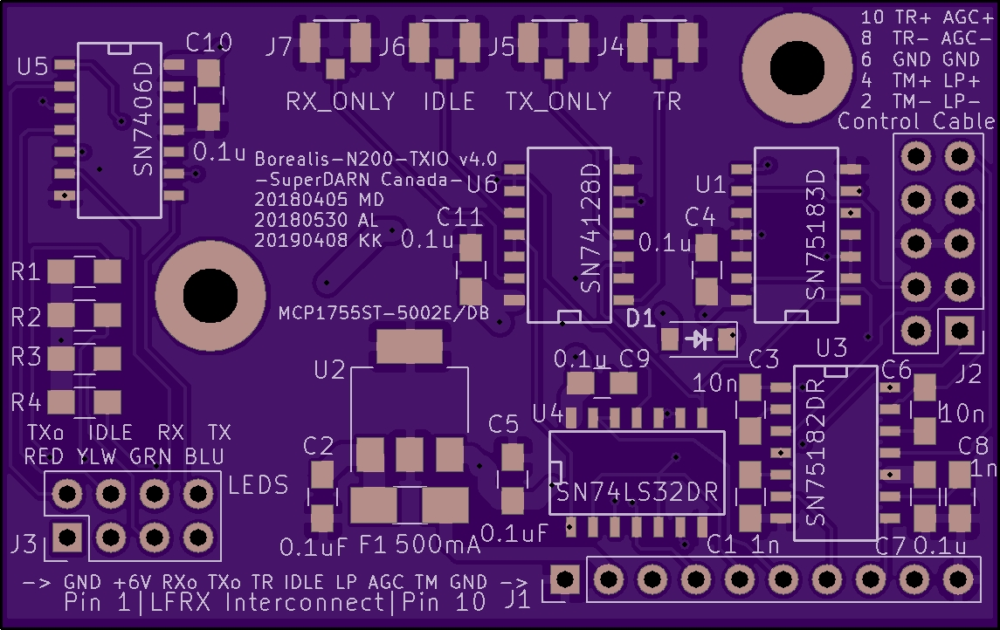

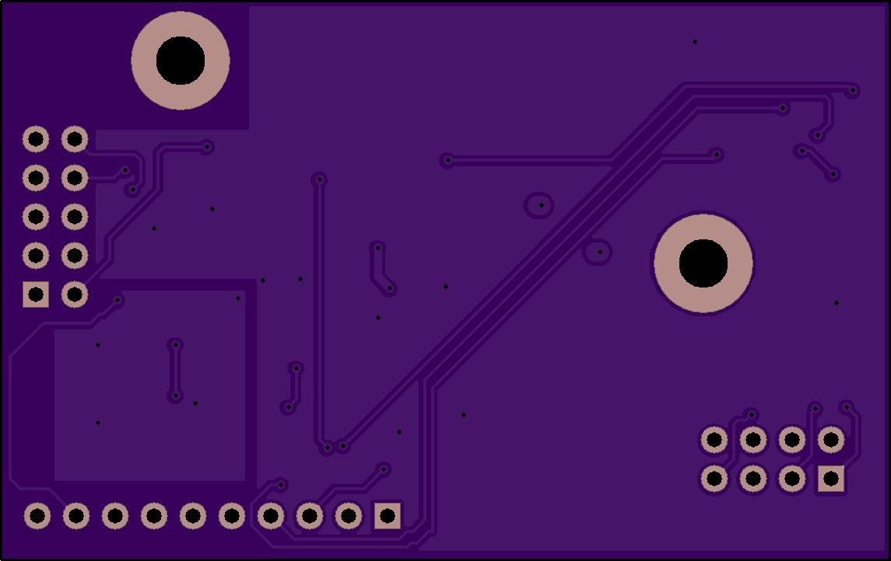
