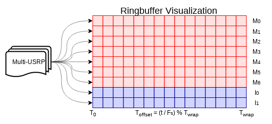

USRP N200 Driver
****************

The N200 driver is a C++ application that controls the operation of the USRP N200 transceivers. The driver is responsible for using Ettus' UHD software to configure a `multi-USRP device <https://files.ettus.com/manual/classuhd_1_1usrp_1_1multi__usrp.html>`_ and configure the device for SuperDARN operation.

As part of the driver, a C++ class was written to abstract the configuration of the N200s. The driver configures the N200s using certain options from the config file as well as options related to the experiment. All runtime options and control are defined by the Radar Control module.

The driver consists of the main function and two worker threads. The main function is responsible for instantiating a USRP object, and configuring some initial runtime options such as which physical devices to use, the GPIO bank, the timing signal masks, the clock source, the subdevs for TX and RX, and the time source. These options are configured once at runtime and then not changed during operation. The main function then starts the transmit, and receive worker threads.

===============
Transmit Thread
===============

On a driver packet indicating the start of a new sequence (SOB is true), the transmit thread will configure some multi-USRP parameters such as what TX channels (antennas) to use, the TX center frequency, and the buffer of samples to send as a pulse. The driver requires these all be set once but can be omitted in future sequences if they are repeated. No need to continually serialize and deserialize duplicated information. Each driver packet in the sequence contains a relative time from the start of the sequence to when the pulse should be transmitted. If SOB is true, then a sequence start time is created by using the UHD current time as a reference to when pulses should start. A slight delay (empirically derived) is added to allow for some CPU time to finish configuring the pulse. Once the pulse time relative to time zero is calculated, the multi-USRP object is configured to send the pulse samples at that time.

TR switching signals are generated using the `USRP ATR <https://files.ettus.com/manual/classuhd_1_1usrp_1_1multi__usrp.html#a57f25d118d20311aca261e6dd252625e>`_ functionality. The ATR pins are only triggered exactly when the USRP is sending or receiving, so in order to properly window the RF signal, zeros are padded to the start and end of the signal. From testing, the zeros do not create any issues such as higher noise, etc. They purely allow us to create a window for TR signals. The actual TR signal is ATR_XX. We are receiving during the whole sequence, so the full-duplex pin is the pin that goes high when we are transmitting while receiving. The current version of borealis does not allow for transmitting only.

After all pulses are sent all the parameters needed for processing the received samples are sent to the DSP unit. Some out-of-band parameters such as the gps lock status are sent to the DSP unit as well, to eventually be passed to data_write. The ringbuffer initialization time and the sequence start time are included so that the DSP unit can properly select where the sequence samples start in the ringbuffer.

==============
Receive Thread
==============

Under heavy load, the USRP does not seem to respond well to timed receive events. We use a continuous receive ringbuffer system to minimize dropped samples. Instead of using a time triggered receive event, we start sampling continuously at a time. We then use the timestamp of the transmit pulse sequence to calculate where in the ringbuffer the pulse sequence samples are located.

   Diagram of Ringbuffer

The diagram above shows that each USRP receive channel maps to an individual ringbuffer implemented in memory. Each square represents a sample, and for brevity only a few channels are shown. T\ :sub:`0` is the beginning sample in time at which the ringbuffer is initialized. T\ :sub:`wrap` is the sample in time at which the ringbuffer wraps around, or the length of ringbuffer. By knowing exactly when the ringbuffer was initialized and the exact time the pulse sequence began, we can calculate where in the ringbuffer the sequence samples are by calculating how many times the buffer wrapped. If `t` is the amount of time passed from when the buffer was initialized to the time the sequence was sent, then T\ :sub:`offset` is calculated by dividing `t` by the sampling frequency, F\ :sub:`s`, to convert time to number of samples, then dividing this result by T\ :sub:`wrap` and taking the remainder. T\ :sub:`offset` is then used as the offset into the buffer from which samples are later copied out for further processing.

Once the multi-USRP is configured, a shared memory handler is created. Received samples are put directly into shared memory that can be accessed by both the driver and Rx Signal Processing. This minimizes the amount of interprocess copying needed. Once the shared memory is created, pointer offsets into the shared memory are calculated for where each channel buffer begins.

The receive thread configures the ringbuffer and shared memory sections. It then initializes the USRP streaming mode. Right before it begins streaming it sends the initialization time and ringbuffer size to transmit thread. This acts as the "go" signal for the transmit thread to begin and the transmit thread needs to send this info to the DSP unit.

.. toctree::
   :glob:

   file/usrp__driver_8cpp.rst
   file/usrp_8hpp.rst

